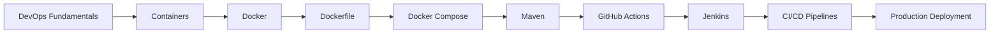

# 🛠️ INT332: DevOps, Virtualization & Configuration Management

Welcome to the ultimate academic and practical resource hub for **INT332: DevOps, Virtualization & Configuration Management**. This repository contains comprehensive course notes, hands-on lab guides, viva preparation material, and cloud deployment pipelines, organized week-by-week to track with your university lectures.

This repository is built to serve as:
- 📚 **Academic Notes** — Complete syllabus coverage for CA & Term End exams.
- 💻 **Lab Manual** — Hands-on tutorials with commands, syntax, and outputs.
- 🎯 **Viva Preparation Guide** — Explanations of core system design & command flags.
- 💼 **DevOps Portfolio** — Fully functional CI/CD pipeline implementations.

---

## 🎯 Course Learning Outcomes

After completing this course, you will be able to:
- [x] Explain DevOps lifecycle models, Agile culture, and collaboration principles.
- [x] Understand virtualization internals: Hypervisors, Namespaces, and Resource limits (cgroups).
- [x] Build custom Docker images, write optimized Dockerfiles, and inspect image layers.
- [x] Configure persistent storage (volumes, bind mounts) and container networks.
- [x] Manage multi-container microservices using Docker Compose.
- [x] Automate Java project compilation, testing, and packaging using Apache Maven.
- [x] Build Continuous Integration (CI) workflows with GitHub Actions.
- [x] Implement Continuous Delivery/Deployment (CD) pipelines with Jenkins.

---

##  Tracks / Flowcharts (using Mermaid `flowchart LR`)


---

## 📂 Repository Structure

```text
INT332/
├── week01/                  # Introduction to Containerization & VM Comparisons
├── week02/                  # Docker Basics, CLI Commands & Storage Volumes
├── week03/                  # Mastering 'docker run', flags & environment variables
├── week04/                  # Architecture Evolution (Monolithic vs Microservices)
├── week05/                  # Containers, Docker Compose & Kubernetes Overview
├── week06/                  # Maven Build Tool Fundamentals & Docker Integration
├── week07/                  # Maven + Docker Integration (Practical Labs)
├── week08/                  # Continuous Integration with GitHub Actions
├── week09/                  # Continuous Integration with Jenkins
├── week10_practical/        # Flask + Docker CI pipeline with GitHub Actions
├── week11_practical/        # Production CD Deployment Pipeline
├── week12_practical/        # Java Maven Build & Docker Hub Automation
└── README.md                # Main documentation hub
```

---

## 📚 Syllabus & Weekly Modules Index

### 📦 Unit I — DevOps Basics & Containerization Fundamentals
*Focuses on virtualization history, Linux container isolation mechanisms, and basic Docker CLI command flows.*
* **Status:** `✅ Complete`
* **Modules:**
  * 📄 [Week 1: Introduction to Containerization](./week01/containerization_guide.md) — *VM vs. Container, runtimes (runc, containerd), namespaces, cgroups, and image layers.*
  * 📄 [Week 2: Docker Basics & CLI Commands](./week02/docker_basics_guide.md) — *Mastering commands, lifecycle (run/stop/rm), volumes, networks, and Apache deployment.*
  * 📄 [Week 3: Mastering `docker run` flags](./week03/docker_commands_env_vars.md) — *Deep dive into detached/interactive modes, pass-through config, and environment variables.*

### 🏗️ Unit II — Microservices & Docker Compose
*Covers the evolution of application architecture and orchestrating multi-container systems.*
* **Status:** `✅ Complete`
* **Modules:**
  * 📄 [Week 4: Monolithic vs. Microservices Architecture](./week04/monolithic_and_microservices.md) — *Core components, database per service patterns, benefits, and tradeoffs.*
  * 📄 [Week 5: Containers & Docker Compose Orchestration](./week05/containers_and_docker_compose.md) — *YAML syntax, volumes, networks, `depends_on` startup order, and WordPress/Node.js deployments.*

### 🛠️ Unit III — Build Automation with Maven
*Bridges the gap between application build processes (Maven lifecycle) and containerized images.*
* **Status:** `✅ Complete`
* **Modules:**
  * 📄 [Week 6: Maven & Build Automation Basics](./week06/maven_and_docker_integration.md) — *POM.xml structure, dependencies, plugins, and custom Java containerization.*
  * 📄 [Week 7: Maven + Docker Practical Integration](./week07/practical_mvn_docker_integration.md) — *Direct image building via Maven compiler and container runtime executions.*

### 🐙 Unit IV — Continuous Integration with GitHub Actions
*Explains workflow automation, YAML triggers, secret management, and registry distribution.*
* **Status:** `✅ Complete`
* **Modules:**
  * 📄 [Week 8: GitHub Actions CI Workflows](./week08/github_actions_guide.md) — *Workflows, jobs, steps, runners, environment secrets, and Docker registry publish.*
  * 📄 [Week 10 (Practical): Flask + Docker CI Pipeline](./week10_practical/flask_docker_github_actions.md) — *E2E automation for linting, testing, image compilation, and Docker Hub pushing.*
  * 📄 [Week 11 (Practical): Production CD Deployment Pipeline](./week11_practical/actions_deployment_pipeline.md) — *Automated release strategies, runner authentication, and direct host deployments.*

### 🚂 Unit V — Continuous Integration with Jenkins
*Covers Jenkins controller-agent architecture, Declarative Jenkinsfiles, and automated testing pipelines.*
* **Status:** `✅ Complete`
* **Modules:**
  * 📄 [Week 9: Jenkins CI/CD Fundamentals](./week09/jenkins_cicd_guide.md) — *Pipeline scripts, controller-agent setups, Webhooks, and security settings.*
  * 📄 [Week 12 (Practical): Java Maven Build & Docker Hub Automation](./week12_practical/java_maven_docker_hub.md) — *Comprehensive Jenkinsfile pipeline compiling Java apps, archiving artifacts, and automating Docker uploads.*

---

## 🚀 Practical Coverage
This repository features fully implemented hands-on labs:
- [x] **Custom Apache Server Setup:** Running `httpd` containers, executing into the shell, and editing documents inside.
- [x] **WordPress + MySQL Compose Setup:** Docker Compose YAML file configuring databases, frontend servers, and persistent volume mounts.
- [x] **Node.js + MongoDB Database Application:** Dynamic REST API backend communicating with isolated database engines over Compose networks.
- [x] **Java Maven Dockerization:** Multi-stage image builds packaging compiled JAR binaries.
- [x] **Flask GitHub Actions CI Pipeline:** Pull request testing, flake8 styling verification, and automated image publishing.
- [x] **Jenkins Declarative Jenkinsfiles:** Pipeline script with checkout, test, compilation, post-clean, and credentials manager authentication.

---

## 🎓 Viva & Exam Preparation Included
Master the answers to common questions included in each guide:
* **Linux Isolation:** PID, NET, MNT namespaces ("I can't see you") vs. control groups (`cgroups`) resource limits ("I can't take your resources").
* **Image Layers:** OverlayFS architecture, read-only layers, and copy-on-write (CoW) writable layer creation.
* **Maven Lifecycle:** Order of stages: `compile` ➔ `test` ➔ `package` ➔ `install` ➔ `deploy`.
* **GitHub Actions:** Difference between workflow triggers (Push, Pull Request, Dispatch) and GitHub runner environments.
* **Jenkins Architecture:** Controller node scheduling workloads vs. SSH Agent runners executing jobs.

---

## 🏆 Key Highlights
* ✨ **Syllabus-Oriented Content:** Designed specifically to map lecture structures to practical setups.
* ✨ **Complete Code Snippets:** Ready-to-use Dockerfiles, Compose files, Action workflows, and Jenkinsfiles.
* ✨ **Visual Explanations:** Clean ASCII diagrams and flowcharts in every module.
* ✨ **Troubleshooting Survival Guides:** Common error messages and their direct command fixes.

---

## 📈 DevOps Roadmap Covered
```
DevOps Fundamentals ➔ Virtualization & Containers ➔ Docker Runtimes & Layering ➔ Storage & Volumes ➔ Networking ➔ Multi-Container Compose ➔ Maven Package Management ➔ GitHub Actions CI ➔ CD Deployment ➔ Jenkins Pipelines ➔ Cloud Registries
```

---

**Prepared with ❤️ for Prashant**
