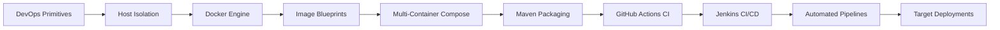

<div align="center">


<br>

### Virtualization • Containerization • Build Automation • CI/CD Pipelines


---

### 🎓 Academic & Author Profile
| Reference Field | Workspace Details |
| :--- | :--- |
| **📘 Course Title** | INT332 – DevOps Virtualization and Configuration Management |
| **🏫 Institution** | Lovely Professional University |
| **🎓 Curriculum** | B.Tech Computer Science & Engineering |
| **👨‍💻 Repository Lead** | Prashant Kumar Sharma |
| **📂 Contents** | Handbooks + Guided Labs + Configurations + Viva & Interview Notes |
| **📈 Syllabus Coverage** | Full 6-Unit Academic & Practical Scope |

</div>

---

# 📖 About This Repository
This workspace contains structured notes, step-by-step practical guides, shell configuration workflows, and continuous integration pipeline definitions mapped across the complete curriculum of **INT332 – DevOps Virtualization and Configuration Management**.

The repository is organized week-by-week and mapped directly into the 6 main theoretical Units to prepare for CA evaluations, end-term lab examinations, and DevOps technical interviews.

This workspace serves as a:
- 📚 Structured Study Ledger
- 💻 Practical Lab Companion
- 🎯 Viva Reference Handbook
- 💼 CI/CD Portfolio Sandbox
- 🚀 Cloud & DevOps Roadmap

---

# 🎯 Course Learning Outcomes
By exploring the resources in this repository, you will be able to:

✅ Implement standard DevOps methodologies and workflows

✅ Understand host-level isolation vs. full hardware virtualization

✅ Configure multi-container environments using Docker Compose

✅ Build, tag, and publish optimized container images

✅ Manage container-native storage volumes and bridge networks

✅ Automate compilation and dependency resolution for Java packages with Maven

✅ Compose declarative workflow pipelines in GitHub Actions

✅ Set up and scale master-agent build automation with Jenkins

✅ Automate delivery pipelines targeting local servers and container registries

---

# 🧰 Technology Stack
<div align="center">

| Technology / Tool | Primary Purpose in Syllabus |
| :--- | :--- |
| 🐳 Docker Engine | App Sandboxing & Containerization |
| 🏗 Docker Compose | Multi-Service Dependency Orchestration |
| ☕ Apache Maven | Java Package Compilation & Dependency Resolution |
| 🌐 Git & GitHub | Distributed Version Control & Collaboration |
| ⚡ GitHub Actions | Cloud-Native Continuous Integration |
| 🔥 Jenkins Server | Automated Continuous Integration & Delivery |
| 🐧 Linux Shell | Host Isolation Environment & CLI Operations |
| 📦 Docker Hub | Public Image Registry Hub |
| 🏢 GitHub CR (GHCR) | Package & Container Distribution Registry |
| 🚀 CI/CD Pipelines | Software Compilation, Verification, & Release Automation |

</div>

---

# 🛤 Learning Journey


---

# 📂 Repository Structure
```text
INT332/
├── week01/                  # Introduction to Containerization & VM Comparisons
├── week02/                  # Docker Basics, CLI Commands & Storage Volumes
├── week03/                  # Mastering 'docker run', flags & environment variables
├── week04/                  # Architecture Evolution (Monolithic vs Microservices)
├── week05/                  # Containers, Docker Compose & Kubernetes Overview
├── week06/                  # Maven Build Tool Fundamentals & Docker Integration
├── week07/                  # Maven + Docker Integration (Practical Labs)
├── week08/                  # Continuous Integration with GitHub Actions
├── week09/                  # Continuous Integration with Jenkins
├── week10_practical/        # Flask + Docker CI pipeline with GitHub Actions
├── week11_practical/        # Production CD Deployment Pipeline
├── week12_practical/        # Java Maven Build & Docker Hub Automation
└── README.md                # Main documentation hub
```

---

## 📚 Unit I – DevOps Infrastructure Basics
### Topics Covered
#### DevOps Culture
- Introduction to DevOps & Agile practices
- Core business need for pipeline automation
- Stages of the DevOps Lifecycle
- Comparison: Agile vs DevOps vs Lean models

#### Host Isolation Primitives
- Evolution of Server Deployments
- Hypervisor-based VMs vs Kernel-isolated Containers
- Architecture of Container Runtimes (runc, containerd)

#### Operating System Primitives
- Namespaces: PID, NET, MNT, IPC, UTS isolation
- Control Groups (cgroups): CPU, RAM, & I/O limits

#### Container Primitives
- Architecture of the Docker Engine
- Interactions between the Docker Daemon & Client
- Artifact types and lifecycle definitions

#### Storage & Layers
- Read-only Image Layering mechanics
- Copy-on-Write (CoW) system files
- Storage drivers & OverlayFS

#### Guided Labs & Notes
- 📄 [Week 1: Introduction to Containerization](./week01/containerization_guide.md)
- 📄 [Week 2: Docker CLI Operations](./week02/docker_basics_guide.md)
- 📄 [Week 3: Mastering `docker run` flags](./week03/docker_commands_env_vars.md)

**✅ Unit Status: Complete**

---

## 🐳 Unit II – Custom Image Compilation & Port Mapping
### Topics Covered
#### Custom Blueprints
- Conceptualizing the Build Context
- Filtering files using `.dockerignore`
- The Docker Build pipeline

#### Image Instructions
- Base layers (`FROM`), running processes (`RUN`)
- Moving code (`COPY`, `ADD`)
- Execution entrypoints (`CMD`, `ENTRYPOINT`)
- Environment configurations (`ENV`, `WORKDIR`, `EXPOSE`)

#### Layer Tracking
- Tagging conventions & semantic versioning
- Inspecting image history and tracking layers

#### Container Networking
- Default Bridge networking configurations
- Host mode & Overlay network routing
- Built-in DNS resolution and Port Forwarding

#### Native Storage
- Persistent Data Volumes
- Directory Bind Mounts

#### Registries & Tokens
- Distributing images to Docker Hub & GHCR
- Setting up Registry PAT (Personal Access Token) authentication

#### Guided Labs & Notes
- 📄 [Week 2: Docker CLI Operations (Networking & Storage Mounts)](./week02/docker_basics_guide.md)
- 📄 [Week 3: Mastering `docker run` flags (Environment Configuration)](./week03/docker_commands_env_vars.md)
- 📄 [Week 1: Introduction to Containerization (Dockerfile Layering)](./week01/containerization_guide.md)

**✅ Unit Status: Complete**

---

## 🏗 Unit III – Service Decomposition & Docker Compose
### Topics Covered
#### Monolithic vs. Microservices
- Core characteristics of Monolithic applications
- Component decomposition strategies
- Structural advantages & API dependencies of Microservices

#### Orchestration with Compose
- Purpose of Multi-Container management tools
- Compose YAML file schemas (services, volumes, networks)
- Defining environment environments and pass-throughs

#### Compose CLI
- Lifecycle: `up`, `down`, `build`, `logs`, `restart`

#### Architecture Labs
- Multi-container web app: Node.js + MongoDB
- Content management: WordPress + MySQL

#### Production Guidelines
- Service startup order configurations via `depends_on`
- Networking boundaries & production security limits

#### Guided Labs & Notes
- 📄 [Week 4: Monolithic vs. Microservices Architecture](./week04/monolithic_and_microservices.md)
- 📄 [Week 5: Containers & Docker Compose Orchestration](./week05/containers_and_docker_compose.md)

**✅ Unit Status: Complete**

---

## ☕ Unit IV – Java Package Management with Maven
### Topics Covered
#### Compilation & Build Automation
- Need for compile-stage build utilities
- Internal architecture of Maven
- Automating repeatable packages

#### Project Object Model (POM)
- Structure of `pom.xml` configuration files
- Defining dependencies & build plugins

#### Execution Phases
- Lifecycle: `validate` ➔ `compile` ➔ `test` ➔ `package` ➔ `verify` ➔ `install` ➔ `deploy`

#### Dependency Management
- Scope definitions (compile, test, provided, runtime)
- Transitive dependencies & handling version conflicts

#### Compiler & Test Plugins
- `maven-compiler-plugin` & `maven-surefire-plugin` config
- Bundling fats jars using the Shade plugin
- Execution wrapper scripts (`mvnw`)

#### Image Integration
- Packaging Java binaries inside multi-stage Docker images

#### Guided Labs & Notes
- 📄 [Week 6: Maven & Build Automation Basics](./week06/maven_and_docker_integration.md)
- 📄 [Week 7: Maven + Docker Practical Integration](./week07/practical_mvn_docker_integration.md)

**✅ Unit Status: Complete**

---

## ⚡ Unit V – Declarative CI Workflows with GitHub Actions
### Topics Covered
#### Continuous Integration Basics
- Core tenets of Git-driven Continuous Integration
- Event-triggered workflow orchestration

#### Pipeline Syntax
- Workflows, runner nodes, execution jobs, and steps
- Action libraries and registry integrations

#### Execution Triggers
- Automatic triggers: `push`, `pull_request`, `schedule`
- Executing workflows manually: `workflow_dispatch`

#### Pipeline Logic
- Using matrix strategies for parallel platform builds
- Caching package dependencies to accelerate execution runtimes

#### Registry Distribution
- Building and pushing images directly to Docker Hub & GHCR via Actions
- Pipeline deployment targeting remote staging nodes

#### Guided Labs & Notes
- 📄 [Week 8: GitHub Actions CI Workflows](./week08/github_actions_guide.md)
- 📄 [Week 10 (Practical): Flask + Docker CI Pipeline](./week10_practical/flask_docker_github_actions.md)
- 📄 [Week 11 (Practical): Production CD Deployment Pipeline](./week11_practical/actions_deployment_pipeline.md)

**✅ Unit Status: Complete**

---

## 🔥 Unit VI – Enterprise Automation with Jenkins
### Topics Covered
#### Jenkins System Core
- Controller-Agent scheduling topologies
- Plugin ecosystems & administration settings

#### Security & Access Control
- Setting up credential managers (SSH keys, tokens)
- User role definitions

#### Code-As-Pipeline
- freestyle jobs vs scripted workflows
- Writing declarative Jenkinsfile pipelines

#### Pipeline Steps
- Executing stages: checkout, compilation, test suite verification, package, registry delivery

#### Docker Integration
- Launching dynamic containerized build agents
- Automated image compilation & Docker Hub releases

#### Build Tool Integrations
- Maven path bindings & JUnit testing reports

#### Webhooks & Automation
- Configuring push-event webhooks to trigger automation runs

#### Configuration Backup
- Strategy outlines for backing up and restoring Jenkins files

#### Guided Labs & Notes
- 📄 [Week 9: Jenkins CI/CD Fundamentals](./week09/jenkins_cicd_guide.md)
- 📄 [Week 12 (Practical): Java Maven Build & Docker Hub Automation](./week12_practical/java_maven_docker_hub.md)

**✅ Unit Status: Complete**

---

## 📊 Repository Progress Dashboard
| Syllabus Unit | Core Focus Area | Completion Status |
| :--- | :--- | :--- |
| **Unit I** | DevOps Infrastructure & Host Isolation | ✅ Complete |
| **Unit II** | Image Building & Container Storage/Networking | ✅ Complete |
| **Unit III** | Docker Compose & Microservices Architecture | ✅ Complete |
| **Unit IV** | Maven Build Automation & Package Compilers | ✅ Complete |
| **Unit V** | GitHub Actions Workflow Integration | ✅ Complete |
| **Unit VI** | Jenkins Enterprise CI/CD Pipelines | ✅ Complete |

<br>

```text
████████████████████████████████████ 100%
```

---

# 🚀 Practical Coverage
This repository features fully implemented hands-on labs:
- [x] **CLI Basics**: Running isolated web servers and editing assets inside live environments.
- [x] **Dockerfile Optimization**: Creating multi-stage Dockerfiles for Python Flask and Java Spring packages.
- [x] **Multi-Container Compose**: Configuring Compose environments for Node/Mongo and WordPress/MySQL stacks.
- [x] **Maven Build Automation**: Managing dependency trees, wrapper setups, and package compilations.
- [x] **Declarative Workflows**: Configuring GitHub Actions for automatic style checks, unit testing, and registry pushes.
- [x] **Distributed Jenkinsfiles**: Constructing Jenkins pipelines utilizing agent nodes, webhooks, and credentials keys.

---

# 🎓 Viva Preparation Questions
Key conceptual questions answered inside the notes:
* How do Linux Namespaces compare to Control Groups (cgroups)?
* Explain OverlayFS layering and the mechanics of Copy-on-Write (CoW).
* What is the difference between image layers and container runtime layers?
* Describe the difference between `depends_on` service start order vs application readiness.
* Detail the phase execution order of the Maven lifecycle.
* How does the Jenkins Master-Agent topology distribute workloads?

---

# 💼 Technical Interview Preparation
Frequently tested areas covered:
* Advantages of container-native isolation over traditional hypervisors.
* Network host/bridge isolation and DNS routing inside Docker.
* Volume persistent mounts vs temporary host directories.
* Transitive dependencies and handling package conflicts in Maven.
* Matrix parallelization and caching in GitHub Action workflows.
* Integrating GitHub webhook events with Jenkins servers.

---

# 🏆 Key Highlights
✨ Structured unit notes mapping classroom lectures to practical setups.

✨ Verified build configurations, Dockerfiles, and Jenkinsfiles.

✨ Step-by-step documentation with commands and expected output.

✨ Dedicated sections for exams and oral examinations.

✨ Designed to prepare you for cloud-native software development.

---

# 📈 DevOps Roadmap Covered
```text
DevOps Concepts
   ↓
Linux OS Isolation
   ↓
Docker Containers
   ↓
Dockerfile Context
   ↓
Docker Compose Services
   ↓
Maven Dependency Compilers
   ↓
GitHub Actions CI
   ↓
Jenkins Pipelines
   ↓
CI/CD Automations
   ↓
Production Deployments
```

---

# 👨‍💻 Author

### **Prashant Kumar Sharma**

- 🎓 B.Tech Computer Science & Engineering
- 🏫 Lovely Professional University
- 📚 INT332 – DevOps Virtualization and Configuration Management

---

<div align="center">

### ⭐ Repository Status: COMPLETE

#### 🚀 From DevOps Fundamentals to Enterprise CI/CD
**Docker - Docker Compose - Maven - GitHub Actions - Jenkins**

If you found this repository useful, consider giving it a ⭐

**Happy Learning & Happy Building! 🚀**

</div>
