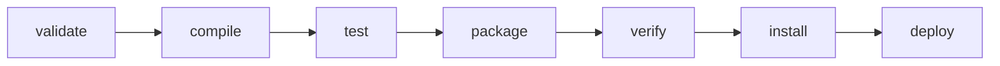
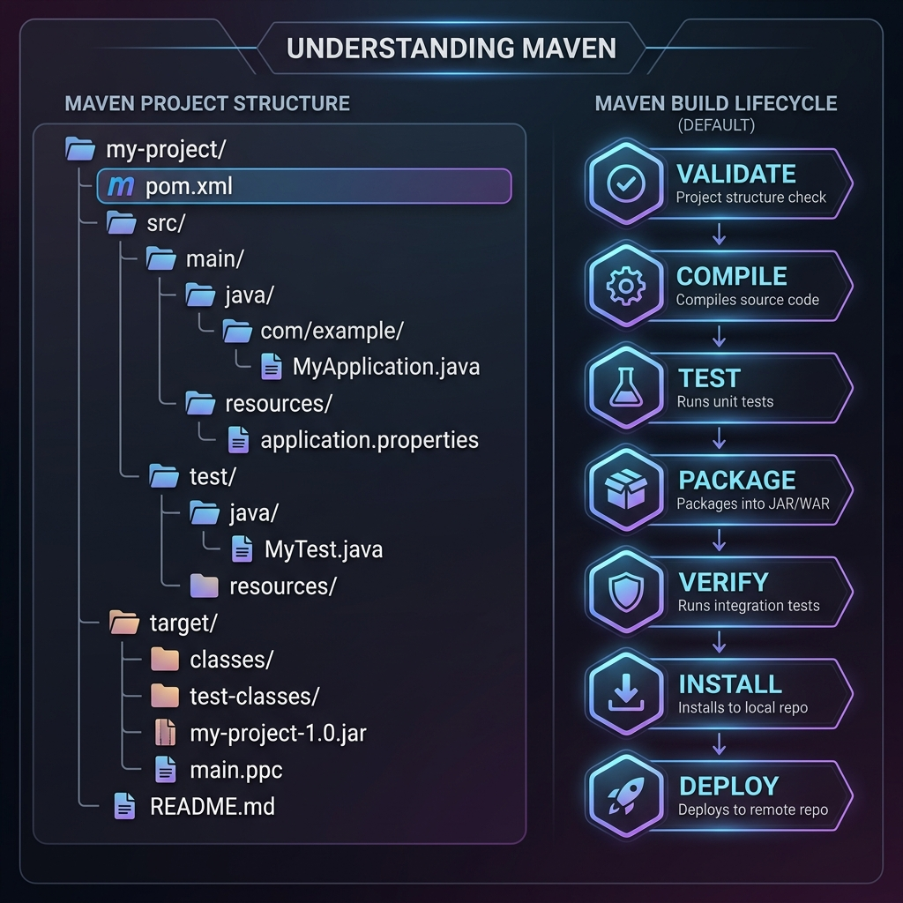
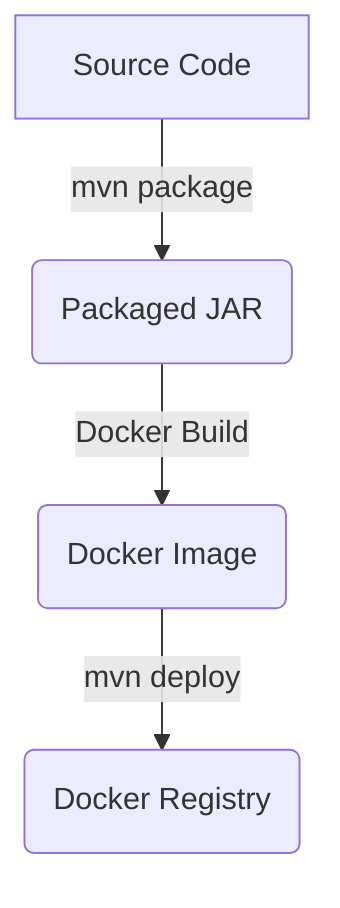
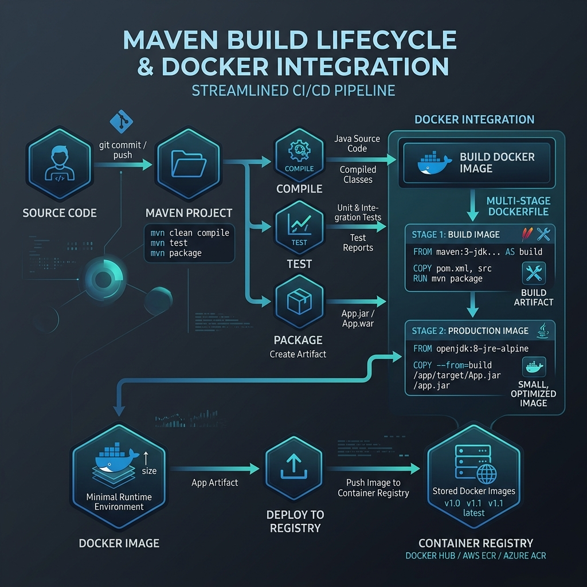

# 📦 Week 6: Maven Build Automation & Docker Integration

Welcome to **Week 6**! This module covers **Maven**, the industry-standard build automation tool for Java applications. We will explore dependency management, the project object model (POM), build lifecycles, parent POMs, plugins, and how to build, containerize, and run Maven applications using **Docker**.

---

## 📑 Table of Contents
1. [Why Build Tools Exist](#1-why-build-tools-exist)
2. [Project Object Model (POM) Structure](#2-project-object-model-pom-structure)
3. [Standard Maven Directory Structure](#3-standard-maven-directory-structure)
4. [Maven Build Lifecycles & Phases](#4-maven-build-lifecycles--phases)
5. [Parent POM & Centralized Config](#5-parent-pom--centralized-config)
6. [Dependency Scope Management](#6-dependency-scope-management)
7. [Transitive Dependencies & Conflict Resolution](#7-transitive-dependencies--conflict-resolution)
8. [Maven Plugins & Executions](#8-maven-plugins--executions)
9. [Maven Wrapper (mvnw)](#9-maven-wrapper-mvnw)
10. [Maven & Docker Integration](#10-maven--docker-integration)
11. [Running Maven inside Containers (Hands-on Steps)](#11-running-maven-inside-containers-hands-on-steps)
12. [🎓 Interview Prep & Revision](#12-interview-prep--revision)

---

## 1. ⚙️ Why Build Tools Exist

In modern software development, build tools automate the process of converting source code into an executable application. Maven solves several critical problems that developers face:

* **Manual Compilation Pain:** Without build tools, developers have to remember and run exact commands (e.g., `javac`), specify classpath arguments, and link external libraries manually. This is highly error-prone and time-consuming.
* **Dependency Hell:** Manually downloading and tracking `.jar` files leads to library version conflicts, missing files, and classpath errors.
* **Inconsistent Builds:** In the absence of a standardized build pipeline, builds differ across environments (e.g., "works on my machine" vs. failing in Production or CI).
* **Repetitive Tasks:** Testing, packaging, and deploying are manual procedures that are tedious to repeat identically for every release cycle.

> [!NOTE]
> **Maven** solves these problems by providing a standardized, declarative, convention-over-configuration build system.

---

## 2. 📄 Project Object Model (POM) Structure

The Project Object Model (POM) is the fundamental unit of work in Maven. It is defined in an XML file named `pom.xml` located in the project's root directory.

### Key Elements of `pom.xml`
* **GroupId:** The unique organization identifier (e.g., `com.example`).
* **ArtifactId:** The name of the project or module (e.g., `my-app`).
* **Version:** The release version of the application (e.g., `1.0.0-SNAPSHOT`).
* **Packaging:** The output artifact format, commonly `jar`, `war`, or `pom`.
* **Dependencies:** A list of external libraries required to compile and run the application.
* **Build:** Configurations for plugins, source directory paths, and output formats.
* **Profiles:** Configurations that enable environment-specific settings (e.g., dev, prod).

### Example `pom.xml`
```xml
<project xmlns="http://maven.apache.org/POM/4.0.0"
         xmlns:xsi="http://www.w3.org/2001/XMLSchema-instance"
         xsi:schemaLocation="http://maven.apache.org/POM/4.0.0 http://maven.apache.org/xsd/maven-4.0.0.xsd">
  <modelVersion>4.0.0</modelVersion>

  <groupId>com.example</groupId>
  <artifactId>my-app</artifactId>
  <version>1.0.0-SNAPSHOT</version>
  <packaging>jar</packaging>

  <dependencies>
    <dependency>
      <groupId>org.junit.jupiter</groupId>
      <artifactId>junit-jupiter-api</artifactId>
      <version>5.10.0</version>
      <scope>test</scope>
    </dependency>
  </dependencies>
</project>
```

---

## 3. 📂 Standard Maven Directory Structure

Maven follows the **"Convention over Configuration"** paradigm, meaning it expects files to be in standard locations so you do not have to configure them manually.

```text
my-project/
├── pom.xml
└── src/
    ├── main/
    │   ├── java/        ← Production Java source code
    │   └── resources/   ← Config files, properties, XMLs
    └── test/
        ├── java/        ← Unit and integration tests
        └── resources/   ← Test-only configuration files and mocks
```

* **`src/main/java`:** Production Java code compiled by Maven.
* **`src/main/resources`:** Non-code files (e.g., application properties, database configs) bundled into the final artifact.
* **`src/test/java`:** Unit/Integration test files (e.g., JUnit classes) executed during the test phase but excluded from the production build.
* **`src/test/resources`:** Test-only configuration resources.
* **`target/`:** Auto-generated directory where Maven places compiled classes, reports, and the final packaged files (JAR/WAR). Can be safely deleted using `mvn clean`.

---

## 4. 🔄 Maven Build Lifecycles & Phases

Maven has three built-in lifecycles: **default**, **clean**, and **site**. 
The default build lifecycle contains several sequential phases:





1. **`validate`:** Checks if the project is correct and all required information is available.
2. **`compile`:** Compiles the source code of the project into `.class` files.
3. **`test`:** Runs unit tests using a testing framework (e.g., JUnit, TestNG).
4. **`package`:** Bundles the compiled code into a distributable format (JAR, WAR).
5. **`verify`:** Runs integration tests and checks to ensure quality criteria are met.
6. **`install`:** Installs the package into the local repository (`~/.m2/repository`) for use as a dependency in other local projects.
7. **`deploy`:** Copies the final package to a remote repository for sharing with other developers.

> [!IMPORTANT]
> **Sequential Execution:** Executing any phase automatically triggers all preceding phases in the lifecycle. For example, running `mvn install` will execute `validate`, `compile`, `test`, `package`, and `verify` beforehand.

---

## 5. 👨‍👦 Parent POM & Centralized Config

In multi-module projects, repeating dependency versions and plugin configurations leads to code duplication. A **Parent POM** centralizes this configuration.

* **Definition:** A Parent POM is a special POM file that other child project modules inherit from.
* **Benefits:**
  * Centralizes version management of external libraries.
  * Standardizes build plugin settings across modules.
  * Simplifies maintenance: updating a version in the parent POM propagates it to all child modules automatically.

### Spring Boot Parent POM Example
```xml
<!-- In child module's pom.xml -->
<parent>
  <groupId>org.springframework.boot</groupId>
  <artifactId>spring-boot-starter-parent</artifactId>
  <version>3.2.0</version>
  <relativePath/> <!-- lookup parent from repository -->
</parent>
```

---

## 6. 🎯 Dependency Scope Management

Dependency scopes define when and where a dependency is included in the project's classpaths (Compile, Test, and Runtime).

| Scope | Available at Compile | Available at Test | Available at Runtime | Description / Use Case |
| :--- | :---: | :---: | :---: | :--- |
| **`compile`** | ✔ | ✔ | ✔ | Default scope. Available everywhere. Bundled in output. |
| **`provided`** | ✔ | ✔ | ✗ | Provided by the JDK or runtime environment (e.g., Servlet API in Tomcat). Not bundled. |
| **`runtime`** | ✗ | ✔ | ✔ | Not needed for compilation, but required during execution (e.g., JDBC driver implementations). |
| **`test`** | ✗ | ✔ | ✗ | Only needed for compiling and running test suites (e.g., JUnit, Mockito). Not bundled. |
| **`system`** | ✔ | ✔ | ✗ | Similar to `provided`, but requires an explicit path to a local JAR file. (Non-portable; discouraged). |
| **`import`** | – | – | – | Only used in `<dependencyManagement>` to import BOMs (Bill of Materials). |

---

## 7. 🌳 Transitive Dependencies & Conflict Resolution

* **Transitive Dependencies:** When you add a dependency `A` that depends on `B`, Maven automatically downloads and links `B` for you.
* **Conflict Resolution ("Nearest Wins"):** If dependency path `X -> Y -> Z (v1.0)` and path `X -> W -> Z (v2.0)` exist, Maven resolves the conflict by picking the version that is closest to the root project (shortest path in the tree).

### Resolving Version Conflicts
1. **Explicit Declaration:** Explicitly declare the dependency version in your own `pom.xml`. Direct dependencies always override transitive ones.
2. **Exclusions:** Exclude specific transitive dependencies to prevent conflict.
3. **Dependency Management:** Use `<dependencyManagement>` to pin specific versions of transitive libraries.

#### Example: Excluding a Transitive Dependency
```xml
<dependency>
  <groupId>com.example</groupId>
  <artifactId>lib-a</artifactId>
  <version>1.2.0</version>
  <exclusions>
    <exclusion>
      <groupId>com.bad</groupId>
      <artifactId>old-lib</artifactId>
    </exclusion>
  </exclusions>
</dependency>
```

---

## 8. 🔌 Maven Plugins & Executions

Plugins perform the actual tasks within the lifecycle phases. Each plugin is composed of one or more **goals** (e.g., `compiler:compile` or `surefire:test`).

### 1. Compiler Plugin
Controls the compiler options like the source and target Java versions.
```xml
<plugin>
  <groupId>org.apache.maven.plugins</groupId>
  <artifactId>maven-compiler-plugin</artifactId>
  <version>3.11.0</version>
  <configuration>
    <source>17</source>
    <target>17</target>
  </configuration>
</plugin>
```

### 2. Surefire Plugin
Executes the unit tests of an application and generates report files. Can be skipped via command line using `-DskipTests`.
```xml
<plugin>
  <groupId>org.apache.maven.plugins</groupId>
  <artifactId>maven-surefire-plugin</artifactId>
  <version>3.1.2</version>
</plugin>
```

### 3. Shade Plugin (Creating an Uber JAR)
An **Uber JAR** (or Fat JAR) contains your compiled application class files along with **all** transitive dependencies unpacked and merged into a single archive. This makes deployment incredibly simple (just run `java -jar app.jar`).

```xml
<plugin>
  <groupId>org.apache.maven.plugins</groupId>
  <artifactId>maven-shade-plugin</artifactId>
  <version>3.5.0</version>
  <executions>
    <execution>
      <phase>package</phase>
      <goals>
        <goal>shade</goal>
      </goals>
      <configuration>
        <transformers>
          <transformer impl="org.apache.maven.plugins.shade.resource.ManifestResourceTransformer">
            <mainClass>com.example.App</mainClass>
          </transformer>
        </transformers>
      </configuration>
    </execution>
  </executions>
</plugin>
```

---

## 9. 🛡️ Maven Wrapper (mvnw)

**The Problem:** Different developers and CI/CD agents may run different versions of Maven, leading to configuration drift or compilation failures.
**The Solution:** **Maven Wrapper (`mvnw`)** allows a project to run with a specific, pinned version of Maven without requiring it to be pre-installed on the host system.

* **Generate Wrapper:**
  ```bash
  mvn wrapper:wrapper
  ```
  This creates `mvnw` (Linux/macOS), `mvnw.cmd` (Windows), and a `.mvn/` configuration folder in the project root.
* **Usage:**
  ```bash
  # Linux/macOS
  ./mvnw clean package

  # Windows Command Prompt / PowerShell
  .\mvnw.cmd clean package
  ```

---

## 10. 🐳 Maven & Docker Integration

Instead of manually building a JAR and copying it to a Docker container, we can leverage multi-stage builds or plugins (like `dockerfile-maven-plugin`) to automate the workflow:





### Multi-Stage Dockerfile for Maven Applications
Multi-stage builds allow us to compile the project in a build container, then copy only the compiled executable JAR to a lightweight runtime container. This keeps the final image footprint small and secure.

```dockerfile
# Stage 1: Build Phase
FROM eclipse-temurin:17-jdk AS build
WORKDIR /app
COPY . .
RUN ./mvnw package -DskipTests

# Stage 2: Runtime Phase
FROM eclipse-temurin:17-jre
WORKDIR /app
COPY --from=build /app/target/*.jar app.jar
EXPOSE 8080
ENTRYPOINT ["java", "-jar", "app.jar"]
```

---

## 11. 💻 Running Maven inside Containers (Hands-on Steps)

If you don't have Maven or JDK installed locally, you can mount your source code directory inside a Maven Docker container and run compilation/packaging tasks.

### Step 1: Create a Working Directory
```powershell
mkdir maven-docker-test
cd maven-docker-test
```

### Step 2: Generate a Maven Quickstart Project using Docker
We mount the current working directory `%cd%` (or `${PWD}` on PowerShell/Bash) inside the container so the generated files are saved directly to our host system.

```powershell
docker run --rm -it -v ${PWD}:/app -w /app maven:3.9.10-eclipse-temurin-17 mvn archetype:generate -DgroupId=com.example -DartifactId=demo-app -DarchetypeArtifactId=maven-archetype-quickstart -DinteractiveMode=false
```

### Step 3: Compile and Build the App inside Docker
Navigate to the newly generated `demo-app` directory and package it using the Docker Maven container.
```powershell
cd demo-app
docker run --rm -it -v ${PWD}:/app -w /app maven:3.9.10-eclipse-temurin-17 mvn clean install
```

---

## 12. 🎓 Interview Prep & Revision

### 🚀 One-Line Revision Notes
* **Maven:** A declarative build automation tool configured using `pom.xml`.
* **Convention over Configuration:** Expects project files to match standard paths (e.g. `src/main/java`).
* **POM:** Project Object Model file (`pom.xml`) containing project metadata, dependencies, and plugins.
* **Build Phases:** Sequentially executed steps (e.g., `compile` ➔ `test` ➔ `package` ➔ `install`).
* **Maven Wrapper (`mvnw`):** Script to run builds using a pinned Maven version without pre-installing it.
* **Dependency Scopes:** Tells Maven where a dependency is needed (`compile`, `test`, `provided`, `runtime`).
* **Uber JAR:** A single executable artifact containing both the application code and all its library dependencies.
* **Multi-Stage Dockerfile:** Separates compilation from packaging to produce small and secure production Docker images.

### 📝 Important Interview / Viva Questions

**Q1. What is the difference between `mvn install` and `mvn deploy`?**
* `mvn install` compiles, packages, and installs the resulting artifact into the **local** repository (`~/.m2/repository`).
* `mvn deploy` does the same but pushes the final package to a **remote** artifact repository (like Nexus or Artifactory) to share with others.

**Q2. What is an Uber JAR / Fat JAR, and how do you build it in Maven?**
* An Uber JAR is an executable file containing the application and all dependencies. It is built using the `maven-shade-plugin` or the `spring-boot-maven-plugin`.

**Q3. How does Maven resolve dependency conflicts when the same library is pulled with different versions?**
* Maven uses the **"Nearest Wins"** resolution algorithm, picking the version closest to the root in the dependency tree. If paths are of equal length, the first declared path wins.

**Q4. What are the benefits of using a Maven Wrapper (`mvnw`)?**
* It eliminates "works on my machine" issues by standardizing the Maven version across development, CI servers, and containerized pipelines.

**Q5. Why is a multi-stage Dockerfile preferred for Maven applications?**
* It isolates build-time dependencies (like the complete JDK and Maven itself) from the final execution image (which only requires a lightweight JRE and the packaged `.jar`), reducing the image size and vulnerability surface area.

---
**Curated for Prashant — Week 6 of INT332**
