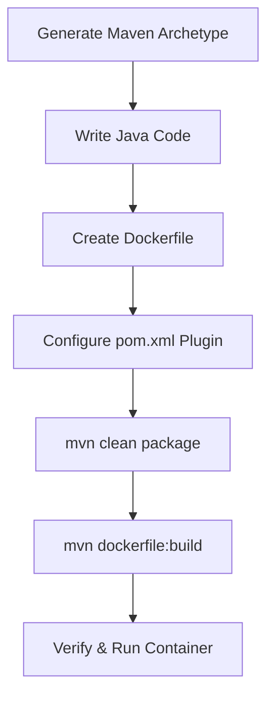
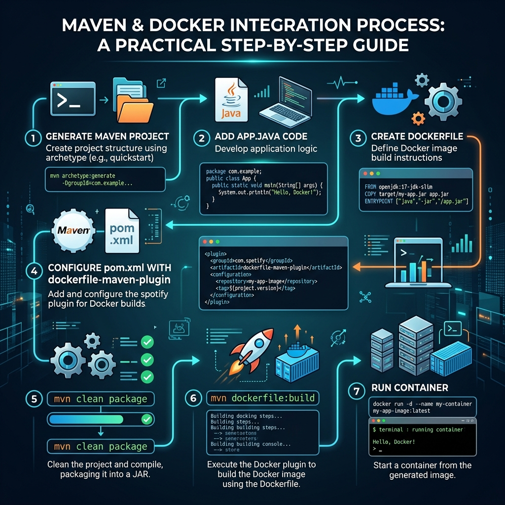

# 🧪 Week 7: Maven + Docker Integration (Practical Guide)

Welcome to **Week 7**! This module is a hands-on practical guide focused on integrating **Maven** and **Docker** using the `dockerfile-maven-plugin`. You will learn how to generate a Maven project, modify its code, configure it to compile into a Docker image directly via Maven build, and run the container successfully.

---

## 📑 Table of Contents
1. [Overview of Practical Integration](#1-overview-of-practical-integration)
2. [Step-by-Step Practical Tutorial](#2-step-by-step-practical-tutorial)
   * [Step 1: Create Maven Project](#step-1-create-maven-project)
   * [Step 2: Modify Java Program](#step-2-modify-java-program)
   * [Step 3: Create Dockerfile](#step-3-create-dockerfile)
   * [Step 4: Configure pom.xml with Docker Plugin](#step-4-configure-pom-xml-with-docker-plugin)
   * [Step 5: Build JAR File](#step-5-build-jar-file)
   * [Step 6: Build Docker Image using Maven](#step-6-build-docker-image-using-maven)
   * [Step 7: Verify Docker Image](#step-7-verify-docker-image)
   * [Step 8: Run Docker Container](#step-8-run-docker-container)
3. [Troubleshooting: Exposing Docker Daemon API](#3-troubleshooting-exposing-docker-daemon-api)
4. [🎓 Interview Prep & Revision](#4-interview-prep--revision)

---

## 1. 🔍 Overview of Practical Integration

The goal of this practical is to establish a unified build workflow where the Maven lifecycle directly compiles our Java application and triggers the generation of a Docker container image without needing external build scripts.



### Visual Steps Roadmap


---

## 2. 🛠️ Step-by-Step Practical Tutorial

### Step 1: Create Maven Project
Generate a quickstart Java application using the Maven archetype generator. Run the following command in your terminal:

```bash
mvn archetype:generate \
  -DgroupId=com.example \
  -DartifactId=docker-maven-demo \
  -DarchetypeArtifactId=maven-archetype-quickstart \
  -DinteractiveMode=false
```

---

### Step 2: Modify Java Program
Navigate to the source directory and edit `src/main/java/com/example/App.java` to contain the following simple printer logic:

```java
package com.example;

public class App {
    public static void main(String[] args) {
        System.out.println("Hello from Docker + Maven Integration!");
    }
}
```

---

### Step 3: Create Dockerfile
In the project root folder (next to `pom.xml`), create a file named `Dockerfile` (with no file extension) and add the following multi-stage or single-stage configurations:

```dockerfile
FROM eclipse-temurin:21-jdk
WORKDIR /app
COPY target/docker-maven-demo-1.0-SNAPSHOT.jar app.jar
ENTRYPOINT ["java", "-jar", "app.jar"]
```

---

### Step 4: Configure `pom.xml` with Docker Plugin
Modify your `pom.xml` in the root of the project to add the `maven-jar-plugin` (to bundle compiled code and define the Main class) and the `dockerfile-maven-plugin` (to handle automated container builds).

```xml
<project xmlns="http://maven.apache.org/POM/4.0.0"
         xmlns:xsi="http://www.w3.org/2001/XMLSchema-instance"
         xsi:schemaLocation="http://maven.apache.org/POM/4.0.0 http://maven.apache.org/xsd/maven-4.0.0.xsd">
    <modelVersion>4.0.0</modelVersion>

    <groupId>com.example</groupId>
    <artifactId>docker-maven-demo</artifactId>
    <version>1.0-SNAPSHOT</version>
    <packaging>jar</packaging>

    <name>docker-maven-demo</name>

    <properties>
        <maven.compiler.source>17</maven.compiler.source>
        <maven.compiler.target>17</maven.compiler.target>
    </properties>

    <dependencies>
        <dependency>
            <groupId>junit</groupId>
            <artifactId>junit</artifactId>
            <version>4.13.2</version>
            <scope>test</scope>
        </dependency>
    </dependencies>

    <build>
        <plugins>
            <!-- JAR Plugin to define Main-Class in MANIFEST.MF -->
            <plugin>
                <groupId>org.apache.maven.plugins</groupId>
                <artifactId>maven-jar-plugin</artifactId>
                <version>3.3.0</version>
                <configuration>
                    <archive>
                        <manifest>
                            <mainClass>com.example.App</mainClass>
                        </manifest>
                    </archive>
                </configuration>
            </plugin>

            <!-- Spotify Dockerfile Maven Plugin -->
            <plugin>
                <groupId>com.spotify</groupId>
                <artifactId>dockerfile-maven-plugin</artifactId>
                <version>1.4.13</version>
                <configuration>
                    <repository>docker-maven-demo</repository>
                    <tag>${project.version}</tag>
                </configuration>
            </plugin>
        </plugins>
    </build>
</project>
```

---

### Step 5: Build JAR File
Run Maven package command to compile the Java class and package it into a `.jar` archive inside the `target/` directory:

```bash
mvn clean package
```

---

### Step 6: Build Docker Image using Maven
Use the plugin goal to trigger the Docker build using your local daemon:

```bash
mvn dockerfile:build
```

---

### Step 7: Verify Docker Image
Confirm that the image is built and stored in your local registry:

```bash
docker images
```
You should see `docker-maven-demo` listed with the tag `1.0-SNAPSHOT`.

---

### Step 8: Run Docker Container
Spin up the container using the newly built image and check the printed logs:

```bash
docker run docker-maven-demo:1.0-SNAPSHOT
```
**Expected Output:**
```text
Hello from Docker + Maven Integration!
```

---

## 3. 🚨 Troubleshooting: Exposing Docker Daemon API

> [!WARNING]
> **Common Issue:** You may encounter socket connection errors like:
> `Connect to localhost:2375 failed: Connection refused` or `Could not build image: java.util.concurrent.ExecutionException`.
> This happens because the `dockerfile-maven-plugin` communicates with Docker via the TCP socket, which is disabled by default on Windows for security.

### Resolution Steps:
1. **Open Docker Desktop** application on your machine.
2. Go to **Settings** (Gear icon in top right corner) ➔ **General**.
3. Locate and **TICK** the option:
   * `Expose daemon on tcp://localhost:2375 without TLS`
4. Click **Apply & Restart**.
5. Go back to your shell and re-run the build command:
   ```bash
   mvn dockerfile:build
   ```

---

## 4. 🎓 Interview Prep & Revision

### 🚀 One-Line Revision Notes
* **dockerfile-maven-plugin:** A Maven plugin created by Spotify to build and push Docker images during the Maven lifecycle.
* **Main-Class Manifest:** The entry inside the packaged JAR defining which class runs by default upon container execution.
* **TCP Socket 2375:** The default network port used by Spotify's plugin to interact with the Docker Daemon API on local setups.
* **mvn clean package:** Clears the `target/` directory and compiles the source code into a executable JAR.

### 📝 Important Interview / Viva Questions

**Q1. What is the role of `maven-jar-plugin` in this integration?**
* It configures the package metadata (`MANIFEST.MF`) to specify `com.example.App` as the entrypoint `mainClass`. Without this, running `java -jar app.jar` would result in a "no main manifest attribute" error.

**Q2. Why does the Spotify dockerfile-maven-plugin require exposing the Docker daemon on TCP port 2375?**
* The plugin connects to the Docker Engine API over TCP to instruct it to run commands equivalent to `docker build`. If the port is closed or blocked, Maven cannot communicate with your Docker daemon.

**Q3. How is the Docker image tag defined in our POM configuration?**
* It dynamically fetches the version value of our project (`<version>1.0-SNAPSHOT</version>`) using the Maven property placeholder `${project.version}`.

---
**Curated for Prashant — Week 7 of INT332**
