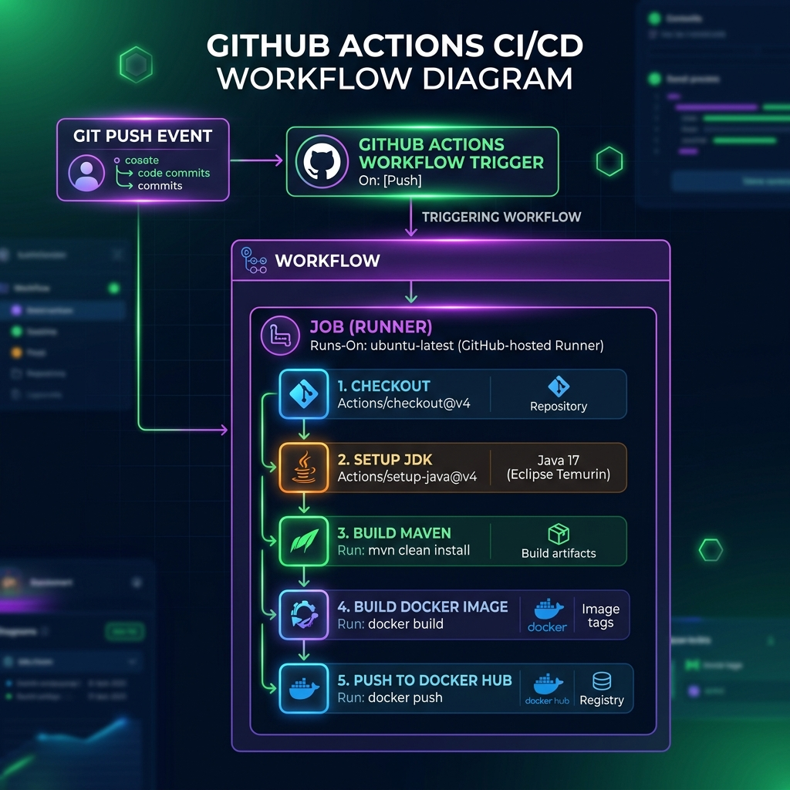

# 🐙 Week 8: CI/CD with GitHub Actions

Welcome to **Week 8**! This module covers **GitHub Actions**, a native Continuous Integration and Continuous Deployment (CI/CD) platform integrated directly into your GitHub repository. It allows you to automate your software development workflows—such as compiling code, running tests, packaging containers, and deploying applications—triggered by specific repository events.

---

## 📑 Table of Contents
1. [Introduction to GitHub Actions](#1-introduction-to-github-actions)
2. [Workflow Automation Concepts](#2-understanding-workflow-automation)
3. [Core Components of GitHub Actions](#3-core-components-of-github-actions)
4. [Triggers and Events](#4-triggers-and-events)
5. [Workflow Directory Structure](#5-workflow-directory-structure)
6. [Jobs, Steps, and Matrix Strategies](#6-jobs-steps-and-matrix-strategies)
7. [Real-Life Example Workflow (Java CI)](#7-real-life-example-workflow-java-ci)
8. [Practice Questions & Troubleshooting](#8-practice-questions--troubleshooting)
9. [🎓 Course Quiz & Interview Prep](#9-course-quiz--interview-prep)

---

## 1. 🚀 Introduction to GitHub Actions

GitHub Actions is an API-driven automation tool that allows you to write workflows to automate tasks directly inside your GitHub repository.

* **Analogy:** Think of GitHub Actions like a smart assistant that automatically performs tasks (like testing or deployment) whenever something happens in your repository.
* **Key Benefits:**
  * **Native Integration:** Built-in with GitHub; no external servers needed.
  * **Event-Driven:** Triggers on pushes, pull requests, issue updates, releases, or cron schedules.
  * **Marketplace:** Thousands of pre-built reusable actions are available (e.g., checkout code, setup Java).

---

## 2. 🧠 Understanding Workflow Automation

A **Workflow** is an automated process defined in a YAML file.
* Workflows are stored in the `.github/workflows/` directory of your repository.
* They contain one or more jobs.
* Each job consists of sequential steps containing commands or reusable actions.

### Basic Workflow Example
```yaml
name: My First Workflow

on: push

jobs:
  build:
    runs-on: ubuntu-latest

    steps:
      - name: Checkout code
        uses: actions/checkout@v3

      - name: Run a script
        run: echo "Hello World"
```

---

## 3. 🧩 Core Components of GitHub Actions

GitHub Actions runs workflows using a set of structured components:

* **Event (`on`):** The trigger that starts the workflow execution (e.g., a git push).
* **Jobs:** A collection of steps that execute on the same runner VM. By default, jobs run in parallel.
* **Steps:** Sequential tasks executed in a job. They can run shell scripts or utilize pre-defined Actions.
* **Actions:** Reusable, standalone code modules that perform complex tasks (e.g., `actions/checkout@v3`).
* **Runners:** Virtual environments (VMs) hosting the job execution. These can be GitHub-hosted (Ubuntu, Windows, macOS) or self-hosted servers.

---

## 4. ⚡ Triggers and Events

* **Event:** The activity that triggers the workflow (e.g., `push`, `pull_request`, `schedule`).
* **Trigger:** The specific configuration parameters under which the event runs the workflow (e.g., pushing only to the `main` branch).

### Triggering with Filters
You can filter triggers by branches, tags, paths, and schedules.

```yaml
on:
  push:
    branches:
      - main
      - dev
    paths:
      - 'src/**'
```

### Types of Triggers
1. **Branch-based Triggers:** `branches: [main, dev]`
2. **Path-based Triggers:** `paths: - 'app/**'`
3. **Tag-based Triggers:** `tags: - 'v1.*'`
4. **Time-based Triggers (Cron Schedule):** Runs at specific times.
   ```yaml
   on:
     schedule:
       - cron: '0 0 * * *' # Every day at midnight
   ```
5. **Manual Trigger (`workflow_dispatch`):** Allows triggering the workflow manually from the GitHub web UI. Useful for on-demand deployments.

---

## 5. 📂 Workflow Directory Structure

Workflows must be organized in the following folder structure at the root of your project:

```text
repository/
├── .github/
│   └── workflows/
│       ├── build.yml
│       └── deploy.yml
├── src/
├── tests/
└── README.md
```

---

## 6. ⚙️ Jobs, Steps, and Matrix Strategies

* **Jobs in Parallel:** Jobs in a workflow run concurrently by default.
  ```yaml
  jobs:
    build:
      runs-on: ubuntu-latest
    test:
      runs-on: ubuntu-latest
  ```
* **Steps in Sequence:** Inside a single job, steps execute sequentially. If a step fails, the job stops execution, and subsequent steps are skipped.
* **Matrix Strategy (Parallel Configurations):** Allows you to run the same job across multiple OS or language versions simultaneously.
  ```yaml
  jobs:
    test:
      runs-on: ubuntu-latest
      strategy:
        matrix:
          node-version: [14, 16, 18]
      steps:
        - uses: actions/setup-node@v3
          with:
            node-version: ${{ matrix.node-version }}
  ```

---

## 7. ☕ Real-Life Example Workflow (Java CI)

This workflow compiles and tests a Java Maven application on every push to the `main` branch:

```yaml
name: Java CI Pipeline

on:
  push:
    branches: [main]

jobs:
  build:
    runs-on: ubuntu-latest

    steps:
      - name: Checkout Repository
        uses: actions/checkout@v3

      - name: Set up Java JDK
        uses: actions/setup-java@v3
        with:
          java-version: '17'
          distribution: 'temurin'

      - name: Build with Maven
        run: mvn clean install
```

### Visual Architecture Flow


---

## 8. 📝 Practice Questions & Troubleshooting

### Exercise 1: Identify the Syntax Error
```yaml
name: CI Pipeline
on push: # ERROR: Should be "on: push" or "on: [push]"
  branches:
    - main
jobs:
 build:
  runs-on ubuntu-latest # ERROR: Missing colon after runs-on
  steps:
    - name Checkout code
      uses actions/checkout@v3 # ERROR: Missing colon after uses
```

### Exercise 2: Branch Specific Trigger
Write a trigger configuration that runs a workflow on push events, but only on the `develop` branch.
```yaml
on:
  push:
    branches:
      - develop
```

### Exercise 3: Basic HelloWorld Workflow
Create a minimal `.yml` file that checks out code and prints "Hello World".
```yaml
name: Hello World Workflow
on: push
jobs:
  say-hello:
    runs-on: ubuntu-latest
    steps:
      - uses: actions/checkout@v3
      - name: Print Message
        run: echo "Hello World"
```

### Exercise 4: Complete CI Workflow
Write a job with steps to checkout code, build (print "Building"), and test (print "Testing").
```yaml
name: Complete CI
on: push
jobs:
  ci-pipeline:
    runs-on: ubuntu-latest
    steps:
      - uses: actions/checkout@v3
      - name: Install dependencies
        run: npm install
      - name: Build project
        run: echo "Building"
      - name: Test project
        run: echo "Testing"
```

---

## 9. 🎓 Course Quiz & Interview Prep

### Quick Classroom Quiz
**Q1. Identify the correct order of execution in GitHub Actions.**
* **Answer:** Workflow ➔ Jobs ➔ Steps (A workflow contains jobs; each job contains sequential steps).

**Q2. Which of the following is a reusable unit in GitHub Actions?**
* A. Job
* B. Step
* **C. Action** (Correct)
* D. Runner

**Q3. A workflow in GitHub Actions is defined using:**
* A. JSON file
* **B. YAML file** (Correct)
* C. XML file
* D. Properties file

**Q4. Where are workflow files stored in a repository?**
* **C. `/.github/workflows/`** (Correct)

**Q5. Which component defines when a workflow runs?**
* **C. Events / Triggers** (Correct)

**Q6. Which of the following is a valid branch push trigger?**
* **B. `on: push: branches: [main]`** (Correct)

**Q7. What is the role of a Runner?**
* **B. Executes the workflow steps** (Correct)

**Q8. Jobs in a workflow run:**
* **B. In parallel by default** (Correct)

**Q9. Steps inside a job run:**
* **C. Sequentially** (Correct)

**Q10. What does the cron expression `0 0 * * *` mean?**
* **C. Every day at midnight** (Correct)

**Q11. You want to test code on multiple node versions simultaneously. What should you use?**
* **B. Matrix strategy** (Correct)

**Q12. If a workflow fails at step 2, what happens?**
* **B. The job stops execution and subsequent steps are skipped** (Correct)

**Q13. GitHub-hosted runners support which environments?**
* **C. Linux, Windows, macOS** (Correct)

---
**Curated for Prashant — Week 8 of INT332**
