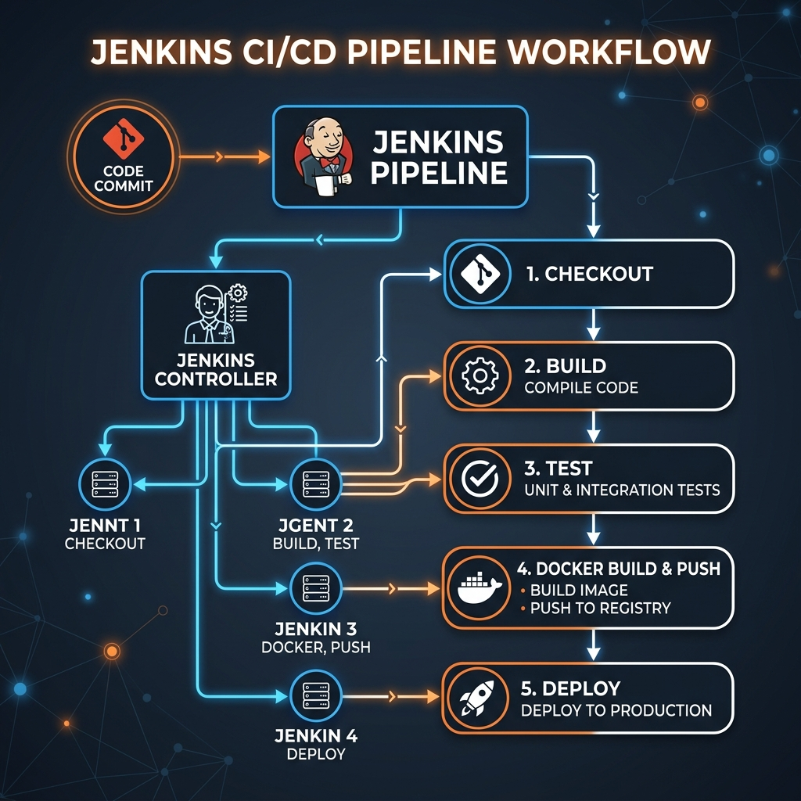

# 🚂 Week 9: CI/CD with Jenkins

Welcome to **Week 9**! This module covers **Jenkins**, the leading open-source automation server. We will explore the core features of Jenkins, its setup, Controller-Agent scaling, plugin architectures, and implement a complete end-to-end CI/CD pipeline using a Spring Boot project, Git, Maven, and Docker.

---

## 📑 Table of Contents
1. [What is Jenkins?](#1-what-is-jenkins)
2. [Why Use Jenkins?](#2-why-use-jenkins)
3. [Jenkins Setup Basics](#3-jenkins-setup-basics)
4. [Creating Your First Job (Freestyle)](#4-creating-your-first-job-freestyle)
5. [End-to-End CI/CD Pipeline Project](#5-end-to-end-cicd-pipeline-project)
   * [1. Project Structure & Code](#1-project-structure--code)
   * [2. Dockerfile Configuration](#2-dockerfile-configuration)
   * [3. Jenkinsfile Configuration](#3-jenkinsfile-configuration)
   * [4. pom.xml Setup](#4-pomxml-setup)
   * [5. Git Push to GitHub](#5-git-push-to-github)
   * [6. Configure Pipeline in Jenkins SCM](#6-configure-pipeline-in-jenkins-scm)
6. [Jenkins Pipelines as Code](#6-jenkins-pipelines-as-code)
7. [Jenkins Plugin System](#7-jenkins-plugin-system)
8. [Troubleshooting & Common DevOps Pipeline Errors](#8-troubleshooting--common-devops-pipeline-errors)
9. [🎓 Interview Prep & Revision](#9-interview-prep--revision)

---

## 1. ⚙️ What is Jenkins?

Jenkins is an open-source automation server. It helps automate the parts of software development related to building, testing, and deploying, facilitating Continuous Integration and Continuous Delivery (CI/CD).
* **CI/CD definition:** CI/CD is a process of automating code integration, build creation, and testing.

---

## 2. 🌟 Why Use Jenkins?

* **Automates** code builds and testing schedules.
* **Integrates** seamlessly with Git, Docker, Maven, Kubernetes, Slack, JIRA, and more.
* **Supports Pipelines** to configure end-to-end delivery automation.
* **Extensive Ecosystem:** Over 1,800+ plugins available for customization.
* **Cross-Platform:** Runs on Linux, Windows, macOS, and inside containers.

---

## 3. 🛠️ Jenkins Setup Basics

### Installing Jenkins
1. Download Jenkins from [jenkins.io](https://www.jenkins.io).
2. Run locally with Java command:
   ```bash
   java -jar jenkins.war
   ```
   *(Or run it inside a Docker container).*

### Initial Dashboard Access
1. Open your browser and navigate to `http://localhost:8080`.
2. Retrieve the initial admin password from the location shown on the screen (found in the Jenkins home folder).
3. **Install Suggested Plugins:** During the setup, Jenkins will recommend installing a standard set of plugins—click to install them.
4. **Create First Admin User:** Set up your administrative credentials (username, password, name, and email).

---

## 4. 📝 Creating Your First Job (Freestyle)

* **Analogy:** Think of a Job as: *"Tell Jenkins what to do and when to do it."* Jobs are the core unit of automation in Jenkins.

### Steps to Create a Freestyle Job:
1. Click **"New Item"** in the top left.
2. Enter a project name (e.g., `my-freestyle-job`).
3. Select **"Freestyle project"** and click OK.
4. **Configure:**
   * **Source Code Management:** Bind your project Git URL.
   * **Build Trigger:** Set SCM polling (`Poll SCM`) or webhooks.
   * **Build Steps:** Define commands to run (e.g., `Execute Shell` or `Invoke top-level Maven targets`).
5. Click **"Save"** and then **"Build Now"** to run.

---

## 5. 🚢 End-to-End CI/CD Pipeline Project

We will implement a pipeline using Jenkins, GitHub, Maven, and Docker.

### Visual Architecture Flow


---

### 1. Project Structure & Code
Create a new directory structure for a Spring Boot Java app:
```bash
mkdir neww
cd neww
mkdir -p src/main/java/com/example
notepad src/main/java/com/example/Application.java
```

Add the following Spring Boot REST Controller code to `Application.java`:
```java
package com.example;

import org.springframework.boot.*;
import org.springframework.boot.autoconfigure.*;
import org.springframework.web.bind.annotation.*;

@SpringBootApplication
@RestController
public class Application {

    public static void main(String[] args) {
        SpringApplication.run(Application.class, args);
    }

    @GetMapping("/")
    public String home() {
        return "CI/CD Working!";
    }
}
```

---

### 2. Dockerfile Configuration
Create a file named `Dockerfile` in the project root to compile the executable container image:
```dockerfile
FROM openjdk:17
COPY target/*.jar app.jar
ENTRYPOINT ["java","-jar","/app.jar"]
```

---

### 3. Jenkinsfile Configuration
Create a `Jenkinsfile` (no extension) in the project root directory. This contains the pipeline definition as code:
```groovy
pipeline {
    agent any

    tools {
        maven 'Maven'
    }

    stages {
        stage('Build') {
            steps {
                bat 'mvn clean package' // Uses Windows Batch command (use sh 'mvn clean package' on Linux)
            }
        }
    }
}
```

---

### 4. `pom.xml` Setup
Create the project descriptors (`pom.xml`) in the root directory:
```xml
<project xmlns="http://maven.apache.org/POM/4.0.0">
    <modelVersion>4.0.0</modelVersion>

    <groupId>com.example</groupId>
    <artifactId>app</artifactId>
    <version>1.0</version>

    <parent>
        <groupId>org.springframework.boot</groupId>
        <artifactId>spring-boot-starter-parent</artifactId>
        <version>3.2.0</version>
    </parent>

    <dependencies>
        <dependency>
            <groupId>org.springframework.boot</groupId>
            <artifactId>spring-boot-starter-web</artifactId>
        </dependency>
    </dependencies>

    <build>
        <plugins>
            <plugin>
                <groupId>org.springframework.boot</groupId>
                <artifactId>spring-boot-maven-plugin</artifactId>
            </plugin>
        </plugins>
    </build>
</project>
```

---

### 5. Git Push to GitHub
Initialize your Git repository and push the files to your GitHub repository:
```bash
git init
git add .
git commit -m "added project files"
git branch -M main
git remote add origin https://github.com/preetkaur18/neww.git
git push -u origin main
```
Verify that `Jenkinsfile`, `pom.xml`, `Dockerfile`, and the `src` directory are successfully pushed to GitHub.

---

### 6. Configure Pipeline in Jenkins SCM
1. Go to your **Jenkins Dashboard** and click **New Item**.
2. Name the project `ci-cd-project`, select **Pipeline**, and click OK.
3. Click on **Configure**.
4. Scroll down to the **Pipeline** section.
5. Set Definition as: **Pipeline script from SCM**.
6. Set SCM as: **Git**.
7. Enter Repository URL: `https://github.com/preetkaur18/neww.git`.
8. Enter Branch Specifier: `*/main`.
9. Set Script Path: `Jenkinsfile`.
10. Click **Save** and select **Build Now** to execute the pipeline.

---

## 6. 🔄 Jenkins Pipelines as Code

A pipeline is a set of automated steps that Jenkins follows to build, test, and deploy your application.
* **Why Use Pipelines?**
  * Automates the entire build and deploy workflow.
  * Makes builds repeatable and version-controlled.
  * Allows complex workflows (parallel stages, conditional logic, error handling).
  * Uses code scripts to define steps (Groovy domain-specific language).

---

## 7. 🔌 Jenkins Plugin System

Plugins are add-ons that extend Jenkins' core capabilities. Without plugins, Jenkins is just a basic automation scheduler.

* **Popular Plugins:**
  * **SCM:** Git, GitLab plugins.
  * **Build Tools:** Maven, Gradle plugins.
  * **Containers:** Docker, Kubernetes plugins.
  * **Alerts:** Email Extension, Slack notifications.
  * **Pipelines:** Workflow / Pipeline plugins.
* **How to Install Plugins:**
  1. Go to **Manage Jenkins** ➔ **Plugins** (or **Manage Plugins**).
  2. Search for the plugin in the **Available plugins** tab.
  3. Select the plugin and click **Install without restart** (or restart Jenkins afterwards).
  
> [!WARNING]
> **Performance Note:** Installing too many unnecessary plugins can lead to performance issues, memory overhead, or dependency version conflicts. Install only what you need!

---

## 8. 🛠️ Troubleshooting & Common DevOps Pipeline Errors

* **Git Checkout Failures:** If you encounter `Failed to fetch from remote Git repository`, verify SSH deploy keys, credentials configuration under Jenkins Credentials manager, or local proxy/firewall configurations.
* **Missing Context variables / Workspace Cleanup:** If calling `cleanWs()` inside a post-execution block throws errors, ensure it executes inside a defined node context block:
  ```groovy
  post {
      always {
          node('any') {
              cleanWs()
          }
      }
  }
  ```

---

## 9. 🎓 Interview Prep & Revision

### 🚀 One-Line Revision Notes
* **Jenkins:** An open-source automation server used to construct CI/CD pipelines.
* **Controller-Agent:** Architecture separating build orchestration from execution.
* **Plugins:** Extend Jenkins features to integrate external tools like Git, Docker, and Maven.
* **Pipeline-as-Code:** Specifying CI/CD stages in code using a `Jenkinsfile` written in Groovy.
* **SCM Sourced Pipeline:** Configuring Jenkins to read build scripts directly from Git.

### 📝 Important Interview / Viva Questions

**Q1. What is the difference between a Freestyle Project and a Pipeline in Jenkins?**
* A Freestyle project is configured manually using the web UI form fields. A Pipeline is defined in a text script (`Jenkinsfile`) using Groovy code, which can be version controlled.

**Q2. Why is it recommended to install only necessary plugins?**
* Excessive plugins cause performance degradation, increase startup times, and run the risk of causing dependency version conflicts between plug-in components.

**Q3. How do you trigger a Jenkins pipeline automatically when code changes?**
* By setting up a webhook on GitHub to send a payload to Jenkins on push events, or using the Poll SCM trigger option to regularly check the git repository for updates.

---
**Curated for Prashant — Week 9 of INT332**
