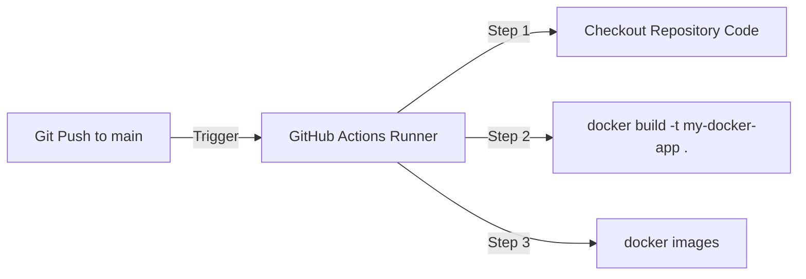
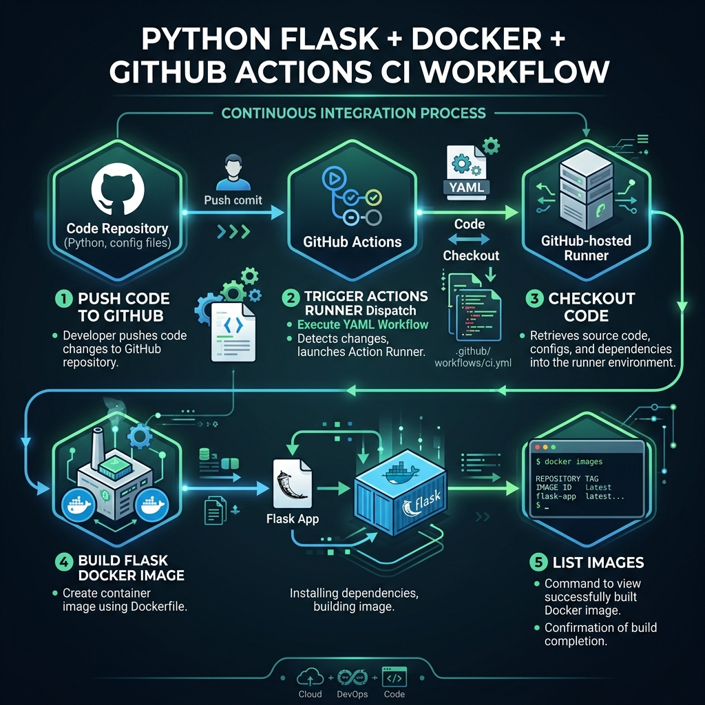

# 🧪 Week 10 Practical: GitHub Actions Workflow with Docker

Welcome to **Week 10 Practical**! In this session, you will learn how to create and build a Python Flask web application, wrap it inside a Docker container, and automate the container compilation using **GitHub Actions**.

---

## 📑 Table of Contents
1. [Overview of Flask + Docker CI Pipeline](#1-overview-of-flask--docker-ci-pipeline)
2. [Step-by-Step Implementation](#2-step-by-step-implementation)
   * [Step 1: Create Project Structure](#step-1-create-project-structure)
   * [Step 2: Create Python Flask Application](#step-2-create-python-flask-application)
   * [Step 3: Define Dependencies](#step-3-define-dependencies)
   * [Step 4: Write Dockerfile](#step-4-write-dockerfile)
   * [Step 5: Define GitHub Actions Workflow](#step-5-define-github-actions-workflow)
3. [Version Control & Git Configurations](#3-version-control--git-configurations)
4. [Running the Application Locally](#4-running-the-application-locally)
5. [🎓 Viva / Interview Preparation](#5-viva--interview-preparation)

---

## 1. 🔍 Overview of Flask + Docker CI Pipeline

This practical demonstrates a Continuous Integration (CI) flow. Every time code is pushed to the `main` branch, GitHub Actions will spin up an Ubuntu runner VM, checkout the source code, and run a Docker build to verify that our image packages correctly.



### Visual Workflow Diagram


---

## 2. 🛠️ Step-by-Step Implementation

### Step 1: Create Project Structure
Initialize a working directory for your application:
```bash
mkdir my-docker-app
cd my-docker-app
```

Within this folder, you will create `app.py`, `requirements.txt`, `Dockerfile`, and the `.github/workflows/` directory.

---

### Step 2: Create Python Flask Application
Create a file named `app.py` and implement a simple REST endpoint returning a hello message:

```python
from flask import Flask

app = Flask(__name__)

@app.route('/')
def home():
    return "Hello from Docker CI/CD!"

if __name__ == "__main__":
    app.run(host='0.0.0.0', port=5000)
```

---

### Step 3: Define Dependencies
Create a `requirements.txt` file and add the required packages:
```text
Flask
```

---

### Step 4: Write Dockerfile
Create a `Dockerfile` (no extension) to containerize the application:
```dockerfile
FROM python:3.9-slim

WORKDIR /app

COPY . .

RUN pip install -r requirements.txt

CMD ["python", "app.py"]
```

---

### Step 5: Define GitHub Actions Workflow
Create a directory named `.github/workflows` and save the pipeline script inside as `ci-cd.yml`:
```yaml
name: CI-CD Pipeline

on:
  push:
    branches:
      - main

jobs:
  build:
    runs-on: ubuntu-latest

    steps:
      - name: Checkout Code
        uses: actions/checkout@v4

      - name: Build Docker Image
        run: docker build -t my-docker-app .

      - name: List Docker Images
        run: docker images
```

---

## 3. 🖥️ Version Control & Git Configurations

Perform the following commands to commit your workspace and push it to a new GitHub repository:

```bash
# 1. Configure user details globally
git config --global user.name "preetkaur18"
git config --global user.email "wahlamanpreet18@gmail.com"

# 2. Initialize repository
git init
git add .
git commit -m "Initial commit"
git branch -M main

# 3. Add remote origin and push
git remote add origin https://github.com/preetkaur18/my-docker-app.git
git push -u origin main
```

> [!NOTE]
> **Staging Workflow Directory Structure:** If you created your workflow file in the wrong directory, you can move it and re-push it to GitHub:
> ```bash
> mkdir .github
> mkdir .github\workflows
> move ci-cd.yaml .github\workflows\ci-cd.yml
> git add .
> git commit -m "Fix workflow path"
> git push
> ```

> [!TIP]
> **Proxy Troubleshooting:** If you encounter network connection problems or proxy blockage when pushing to GitHub on college/company networks, reset your proxy configurations using:
> ```powershell
> netsh winhttp reset proxy
> [Environment]::SetEnvironmentVariable("HTTP_PROXY", "", "User")
> [Environment]::SetEnvironmentVariable("HTTPS_PROXY", "", "User")
> git -c http.proxy= -c https.proxy= push -u origin main
> ```

---

## 4. 🚀 Running the Application Locally

During a practical examination or viva, you may be asked to run the containerized application on your local machine.

### 1. Build the Docker Image
```bash
docker build -t my-docker-app .
```

### 2. Run the Container
Map port `5000` of the host system to port `5000` of the container:
```bash
docker run -p 5000:5000 my-docker-app
```

### 3. Verify in Browser
Open your browser and navigate to:
[http://localhost:5000](http://localhost:5000)

**Expected Page Output:**
`Hello from Docker CI/CD!`

---

## 5. 🎓 Viva / Interview Preparation

**Q1. What does the instruction `CMD ["python", "app.py"]` do in the Dockerfile?**
* It defines the default command to execute when the container spins up, starting our Python Flask application.

**Q2. Why is the Flask host configured as `0.0.0.0` in `app.py`?**
* By default, Flask runs on `127.0.0.1` (localhost), which would only be accessible inside the isolated container itself. Setting it to `0.0.0.0` binds Flask to all available network interfaces, exposing it outside the container so the host computer can access it on port 5000.

**Q3. What is the significance of the `actions/checkout@v4` action in our workflow?**
* The virtual runner machine starting up has an empty filesystem. `actions/checkout@v4` is a pre-packaged action that pulls our codebase from the GitHub repository into the runner's workspace, allowing subsequent steps (like `docker build`) to compile the project.

---
**Curated for Prashant — Week 10 Practical of INT332**
