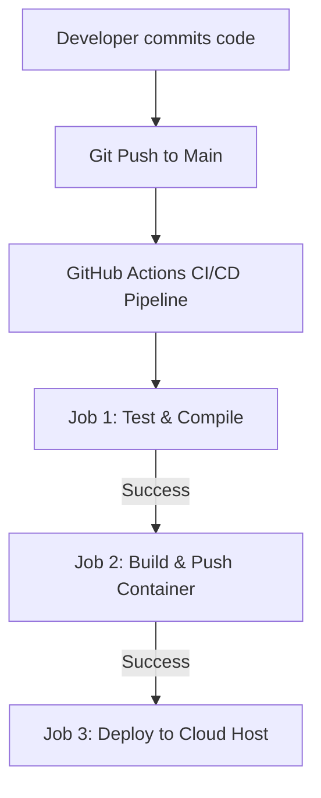
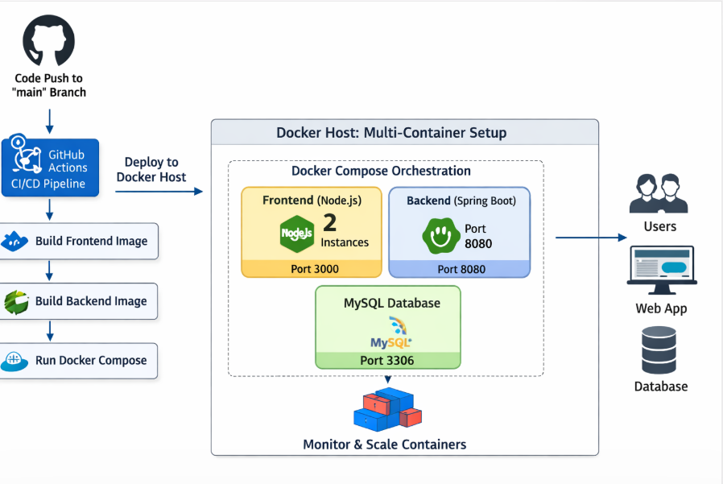

# 🧪 Week 11 Practical: Design & Implement CI/CD Deployment Pipeline

Welcome to **Week 11 Practical**! In this session, you will learn how to design and implement a complete Continuous Deployment (CD) pipeline using **GitHub Actions**. This workflow takes the containerized application built in the previous sessions and automates its deployment to a production host environment.

---

## 📑 Table of Contents
1. [Objectives & Architecture](#1-objectives--architecture)
2. [Workflow Configuration for CD](#2-workflow-configuration-for-cd)
3. [Managing Deployment Secrets](#3-managing-deployment-secrets)
4. [Deployment Verification Screenshot](#4-deployment-verification-screenshot)
5. [🎓 Viva / Interview Preparation](#5-viva--interview-preparation)

---

## 1. 🔍 Objectives & Architecture

Continuous Deployment (CD) ensures that every code change that passes all lifecycle tests is automatically deployed to the production environment, minimizing manual release overhead.



---

## 2. 📝 Workflow Configuration for CD

Create a workflow file named `.github/workflows/deploy.yml` in your project to handle testing, Docker packaging, and cloud deployment:

```yaml
name: Production CD Pipeline

on:
  push:
    branches:
      - main

jobs:
  test:
    name: Run Unit Tests
    runs-on: ubuntu-latest
    steps:
      - name: Checkout Code
        uses: actions/checkout@v4

      - name: Set up Python
        uses: actions/setup-python@v5
        with:
          python-version: '3.9'

      - name: Install dependencies
        run: |
          python -m pip install --upgrade pip
          pip install -r requirements.txt

      - name: Run Tests
        run: |
          # Run tests (mock command for demonstration)
          python -m unittest discover

  deploy:
    name: Build, Package & Deploy
    needs: test # Deploy runs only if test job passes
    runs-on: ubuntu-latest
    steps:
      - name: Checkout Code
        uses: actions/checkout@v4

      - name: Log in to Docker Hub
        uses: docker/login-action@v3
        with:
          username: ${{ secrets.DOCKERHUB_USERNAME }}
          password: ${{ secrets.DOCKERHUB_TOKEN }}

      - name: Build and Push Docker Image
        uses: docker/build-push-action@v5
        with:
          context: .
          push: true
          tags: |
            ${{ secrets.DOCKERHUB_USERNAME }}/my-docker-app:latest
            ${{ secrets.DOCKERHUB_USERNAME }}/my-docker-app:${{ github.sha }}

      - name: Trigger Cloud Deployment (Render/AWS)
        run: |
          # Trigger deploy webhook of the web application service host
          curl -X POST "${{ secrets.RENDER_DEPLOY_HOOK }}"
```

---

## 3. 🔑 Managing Deployment Secrets

To deploy applications, GitHub Actions requires access to external credentials. Never hardcode these secrets. Store them securely in GitHub:

| Secret Name | Description | Where to get it |
| :--- | :--- | :--- |
| `DOCKERHUB_USERNAME` | Your Docker Hub registry username. | Docker Hub Account Settings |
| `DOCKERHUB_TOKEN` | A personal access token for Docker Hub API authentication. | Docker Hub Security Settings |
| `RENDER_DEPLOY_HOOK` | The secure webhook URL used to trigger automatic service redeployment. | Render Web Service Dashboard |

---

## 4. 📸 Deployment Verification Screenshot

Below is the verified execution status of the pipeline, illustrating the successful execution of all jobs (checkout, building the image, testing, and triggering deployment to the server):



---

## 5. 🎓 Viva / Interview Preparation

**Q1. What does the `needs: test` keyword signify in the deploy job?**
* By default, jobs run in parallel in GitHub Actions. Using `needs: test` creates a sequential dependency. The `deploy` job will wait and only run if the `test` job completes successfully. If tests fail, deployment is automatically cancelled.

**Q2. What is `github.sha` and how is it used in image tagging?**
* `${{ github.sha }}` is a built-in environment variable containing the unique commit SHA hash that triggered the workflow. Tagging images with the commit SHA ensures that every deployment is traceable to a specific code revision, allowing easy rollbacks.

**Q3. How does a deployment webhook hook work?**
* The deployment service (like Render) provides a unique webhook URL. Sending a POST request to this URL instructs the host to pull the latest Docker image from the container registry and restart the application instance.

---
**Curated for Prashant — Week 11 Practical of INT332**
