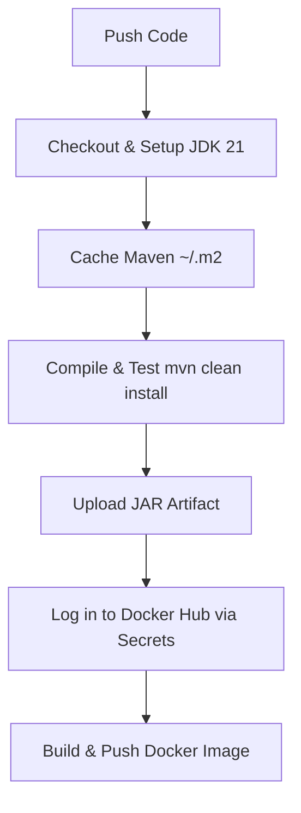
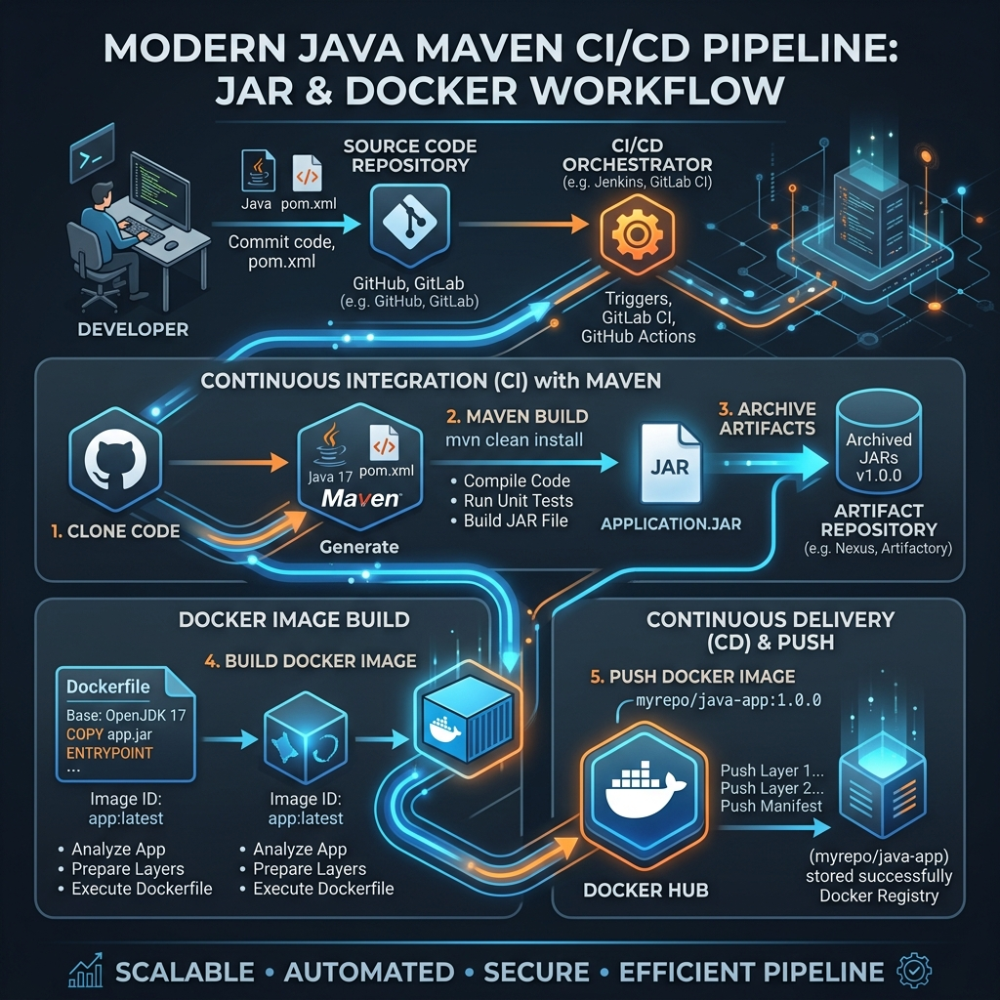

# 🧪 Week 12 Practical: Java Maven Build & Docker Hub Automation

Welcome to **Week 12 Practical**! In this session, you will learn how to build, test, and archive Java artifacts using Maven in a CI pipeline, and automate pushing container images to Docker Hub.

---

## 📑 Table of Contents
1. [Overview of Java & Docker Hub CI/CD](#1-overview-of-java--docker-hub-cicd)
2. [Practical 4: Java CI with Maven & Artifact Archiving](#2-practical-4-java-ci-with-maven--artifact-archiving)
   * [Problem Statement](#problem-statement)
   * [Workflow Script (ci.yml)](#workflow-script-ciyml)
   * [Detailed Step-by-Step Breakdown](#detailed-step-by-step-breakdown)
3. [Practical 5: Docker Hub Image Automation](#3-practical-5-docker-hub-image-automation)
   * [Problem Statement](#problem-statement-1)
   * [Workflow Script (docker-hub-push.yml)](#workflow-script-docker-hub-pushyml)
   * [Secrets & Env Variables Role](#secrets--env-variables-role)
4. [🎓 Viva / Interview Preparation](#4-viva--interview-preparation)

---

## 1. 🔍 Overview of Java & Docker Hub CI/CD

Combining dependency caching, artifact uploading, and automatic Docker packaging ensures that your Java application builds quickly, runs tests successfully, and is immediately available in production registries.



### Visual Workflow Roadmap


---

## 2. 📦 Practical 4: Java CI with Maven & Artifact Archiving

### Problem Statement
Create a workflow configuration file (`.github/workflows/ci.yml`) that performs the following tasks:
1. Checks out the source code from the repository.
2. Sets up the appropriate Java Development Kit (JDK 21) version.
3. Installs project dependencies using Maven (with local caching enabled).
4. Compiles the application and executes unit tests.
5. Archives the generated build artifacts (JAR/WAR files) for future deployment.

---

### Workflow Script (`ci.yml`)
```yaml
name: Java CI with Maven

on:
  push:
    branches: [ "main" ]
  pull_request:
    branches: [ "main" ]

jobs:
  build:
    runs-on: ubuntu-latest

    steps:
      - name: Checkout repository
        uses: actions/checkout@v4

      - name: Set up JDK
        uses: actions/setup-java@v4
        with:
          java-version: '21'
          distribution: 'temurin'

      - name: Cache Maven packages
        uses: actions/cache@v4
        with:
          path: ~/.m2
          key: ${{ runner.os }}-m2-${{ hashFiles('**/pom.xml') }}
          restore-keys: |
            ${{ runner.os }}-m2

      - name: Build with Maven
        run: mvn -B clean install

      - name: Run Tests
        run: mvn test

      - name: Upload Artifact
        uses: actions/upload-artifact@v4
        with:
          name: java-build-artifact
          path: target/*.jar
```

---

### Detailed Step-by-Step Breakdown

* **Set up JDK (`actions/setup-java@v4`):** Configures the temurin JDK 21 distribution in the runner environment.
* **Cache Maven packages (`actions/cache@v4`):** Caches the Maven repository folder (`~/.m2`). The key is computed dynamically using a hash of the project's `pom.xml`. If the `pom.xml` hasn't changed, Maven loads dependencies from the cache instead of downloading them from the Internet, speeding up build run times significantly.
* **Build and Test:** `mvn -B clean install` runs Maven in non-interactive batch mode (`-B`), compiles classes, runs unit tests, and packages code. `mvn test` executes testing configurations.
* **Upload Artifact (`actions/upload-artifact@v4`):** Saves the packaged `.jar` file located in the `target/` directory, allowing you to download the binary package directly from the GitHub Actions dashboard.

---

## 3. 🐳 Practical 5: Docker Hub Image Automation

### Problem Statement
Set up a Continuous Integration (CI) pipeline using GitHub Actions that automatically builds and pushes a Docker image to Docker Hub whenever code is pushed. Create a workflow file that checks out the repository, logs in to Docker Hub using GitHub secrets, builds the image from the Dockerfile, tags it as `username/app-ci:latest`, and pushes it. Also, explain the role of environment variables and secrets.

---

### Workflow Script (`docker-hub-push.yml`)
```yaml
name: Build & Push Docker Image

on:
  push:
    branches:
      - main

jobs:
  docker-build-push:
    runs-on: ubuntu-latest

    steps:
      - name: Checkout Code
        uses: actions/checkout@v4

      - name: Log in to Docker Hub
        uses: docker/login-action@v3
        with:
          username: ${{ secrets.DOCKERHUB_USERNAME }}
          password: ${{ secrets.DOCKERHUB_TOKEN }}

      - name: Build and Push Docker Image
        uses: docker/build-push-action@v5
        with:
          context: .
          push: true
          tags: ${{ secrets.DOCKERHUB_USERNAME }}/app-ci:latest
```

---

### Secrets & Env Variables Role

#### 1. Encrypted Secrets (e.g., `${{ secrets.DOCKERHUB_TOKEN }}`)
* **Purpose:** Safely store sensitive authentication details such as API tokens, passwords, and SSH keys.
* **Why use them:** Hardcoding passwords in a public or private GitHub repository is a major security vulnerability. Secrets are stored in encrypted format in GitHub settings and are dynamically injected during pipeline run times. They are automatically masked in the execution logs (`***`).

#### 2. Environment Variables (e.g., `runs-on: ubuntu-latest`)
* **Purpose:** Store configuration options that are not sensitive (e.g., build paths, application ports, database names, compiler flags).
* **Why use them:** They make workflows configurable, allowing you to reuse values across multiple build steps or environment configurations without hardcoding.

---

## 4. 🎓 Viva / Interview Preparation

**Q1. What is the difference between archiving an artifact using `upload-artifact` and pushing an image to Docker Hub?**
* `upload-artifact` saves files (like JARs or ZIPs) temporarily inside GitHub's storage, accessible only via the GitHub web interface. Pushing to Docker Hub sends a packaged container image to an external container registry, allowing deployment engines to fetch and run it anywhere.

**Q2. How does dependency caching work in GitHub Actions?**
* The `actions/cache` plugin checks if a cache exists for a specific key (which is tied to the hash of `pom.xml`). If the key matches, it downloads the cached packages to local storage (`~/.m2`). If the `pom.xml` changes, a cache miss occurs, dependencies are downloaded afresh from Maven Central, and a new cache key is saved for future builds.

**Q3. Why is it recommended to use a Docker Hub Token instead of your actual account password?**
* A token is revocable, scope-limited, and can be deleted without changing your main account password if it becomes compromised.

---
**Curated for Prashant — Week 12 Practical of INT332**
