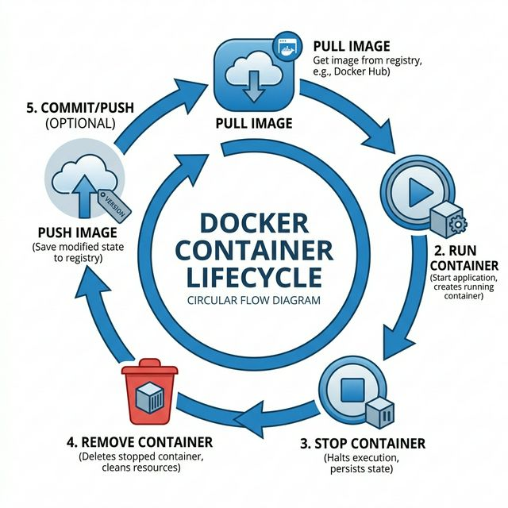
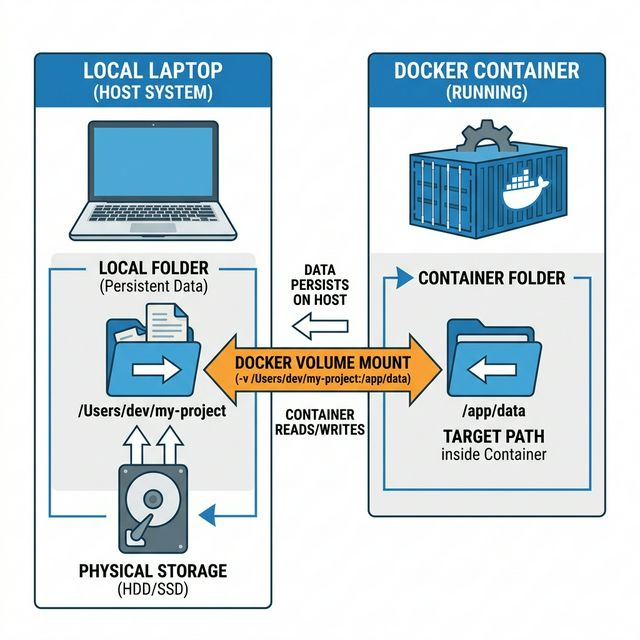
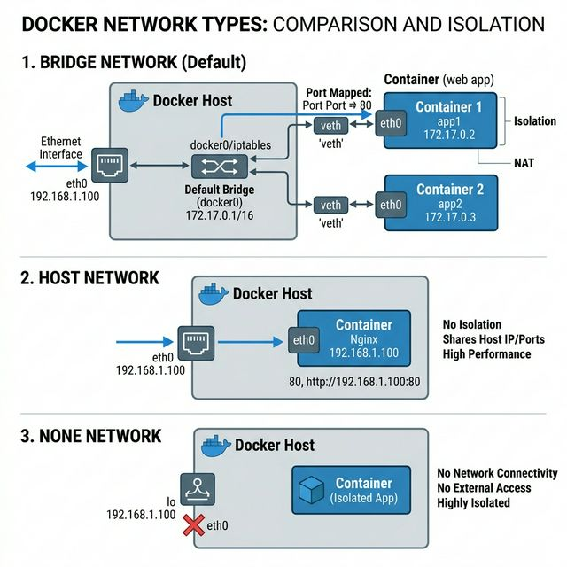
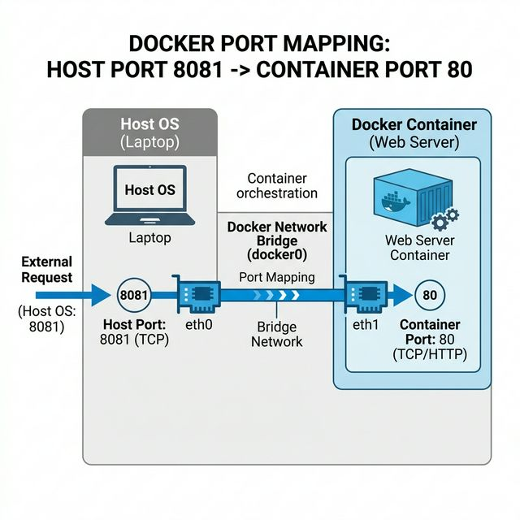

# 🐳 Week 2: Docker Basics — Master the CLI

Welcome to **Week 2** of INT332! This module is designed for the **CA-1 DevOps Exam Prep**, focusing on hands-on container management.

---

## 📑 Table of Contents
1. [Core Mental Models](#1-core-mental-models-first-principles)
2. [The Lifecycle: Run, Stop, Remove](#2-container-management-lifecycle)
3. [The "Truth" Commands (Debugging)](#3-debugging-tools-knowing-the-truth)
4. [Persistent Storage: Volumes](#4-docker-volumes-store-forever)
5. [Connecting: Docker Networking](#5-networking-connecting-containers)
6. [🎓 CA-1 Practical Task: Apache server](#6-ca-1-practical-lab-deploy-apache)
7. [🛡️ Troubleshooting & Common Mistakes](#7-the-ca-1-survival-guide-common-errors)
8. [🚀 Summary Cheat Sheet](#8-devops-mindset--summary)

---

## 1. Core Mental Models (First Principles)
Before running commands, fix these in your mind:
- **Image** = Blueprint 📦 (Template)
- **Container** = Running instance 🚀 (Temporary Compute)
- **Volume** = Hard Disk 💾 (Permanent Data)
- **Network** = Bridge 🌐 (Communication Layer)

---

## 2. Container Management Lifecycle



### 🏎️ Essential Commands
| Command | Flag | Use Case |
| :--- | :---: | :--- |
| `docker pull <image>` | - | Download image from Docker Hub. |
| `docker run` | `-d` | **Detached Mode**: Run in background (Free terminal). |
| `docker run` | `-p` | **Port Mapping**: Map Laptop Port to Container Port. |
| `docker run` | `--name` | **Naming**: Give your container a custom name. |

### 🧹 Clean-Up (The Bulk Way)
When your system gets messy:
> `docker stop $(docker ps -q)` — Stop all running ones.
> `docker rm -f $(docker ps -aq)` — Force delete EVERYTHING (containers).
> `docker rmi $(docker images -q)` — Delete all images.

---

## 3. Debugging Tools: Knowing the "Truth"
> [!IMPORTANT]
> **DO NOT GUESS — ALWAYS VERIFY.**

- **docker logs <name>**: What happened? (Standard output).
- **docker logs -f <name>**: Live streaming (useful for crashes).
- **docker inspect <name>**: Display detailed **JSON configuration** + Metadata.
- **docker stats**: Live performance (How much CPU/RAM is it eating?).
- **docker top <name>**: What processes are running inside right now?

---

## 4. Docker Volumes: Store Forever
By default, containers are **Immutable**. Delete the container → data is gone. Use **Volumes** to save data permanently.



- **Scenario**: Mounting local folder to Apache:
`docker run -d -p 8081:80 -v $(pwd):/usr/local/apache2/htdocs/ httpd`

> [!NOTE]
> Actual data on host (Linux): `/var/lib/docker/volumes/<name>/_data`

---

## 5. Networking: Connecting Containers



| Network | Description | Use Case |
| :--- | :--- | :--- |
| **Bridge** | Default, isolated. | Standard dev/prod environment. |
| **Host** | NO isolation, same IP as PC. | Highest performance (Rarely used). |
| **None** | No external network. | Maximum Security. |

---

## 6. 🎓 CA-1 Practical Lab: Deploy Apache
**Goal**: Run Apache (`httpd`) and customize the website.



### Step 1: Initialize
```bash
docker pull httpd
docker run -d -p 8081:80 --name task3 httpd
```

### Step 2: Live Hack (Enter Container)
```bash
docker exec -it task3 /bin/bash         # Enter Terminal
cd /usr/local/apache2/htdocs/           # Navigate to docroot
echo "<h1>Practice Success Prashant 🚀</h1>" > index.html
exit                                    # Leave terminal
```

### Step 3: Verify
Visit `http://localhost:8081` in your browser.

---

## 7. The CA-1 Survival Guide: Common Errors

| Error | Solution |
| :--- | :--- |
| **"Name already in use"** | `docker rm -f <name>` |
| **"Image not found"** | `docker pull <image>` |
| **"vi: command not found"** | Use `echo "text" > file` instead. |
| **"Cannot connect"** | Use the **Host Port** you defined in `-p`. |

---

## 8. DevOps Mindset & Summary
**Remember this flow:**
1. **Pull** → Download
2. **Run** → Background + Ports
3. **Verify** → `ps` and `logs`
4. **Modify** → `exec` or `volume`

---
**Prepared for CA-1 Exam by Prashant**
