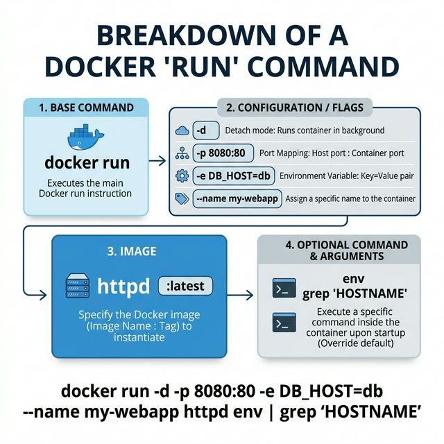
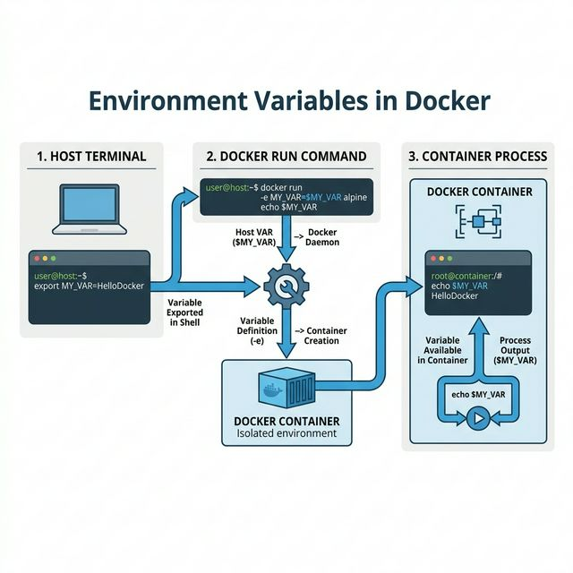

# 🐳 Week 3: Master the `docker run` Command

Welcome to Week 3! This module dives deep into **Flags, Environment Variables, and Automation**. By the end of this, you will know exactly how to configure your containers like a pro.

---

## 📑 Table of Contents
1. [First Principles: The Container Factory](#1-first-principles-the-container-factory)
2. [Anatomy of a `docker run` Command](#2-anatomy-of-a-docker-run-command)
3. [Deep Dive: Essential Flags](#3-essential-flags-deep-dive)
4. [Environment Variables (-e) & Configuration](#4-environment-variables-e--configuration)
5. [Connecting Host to Container (Env Flow)](#5-connecting-host-to-container-env-flow)
6. [Interactive Terminal & Sh-Commands](#6-interactive-terminal--sh-commands)
7. [🎓 Interview Prep Checklist](#7-interview-prep-checklist)
8. [Summary Tasks for Practice](#8-summary-tasks-for-practice)

---

## 1. First Principles: The Container Factory
Think of Docker like an **Automated Factory**:
- **Image**: The blueprinted design.
- **Factory**: The Docker Engine.
- **Container**: The working, living product.

> [!TIP]
> **Key Equation:** `docker run` = Image + Configuration + Instructions

---

## 2. Anatomy of a `docker run` Command
Every part of the command has a specific purpose.



| Part | Example | Purpose |
| :--- | :--- | :--- |
| **Base Command** | `docker run` | Create + Start the container. |
| **Config Flags** | `-dit -p 80:80` | Set up networking, background mode, etc. |
| **Image** | `nginx` | The template to use. |
| **Override Command** | `env` | (Optional) The process to run inside. |

---

## 3. Essential Flags Deep Dive

- **`-d` (Detached)**: Background execution. Your terminal stays free.
- **`-it` (Interactive)**: Connects you to the container's standard input. Use this for debugging.
- **`--name`**: Give your container a professional name (e.g., `--name prod-web`).
- **`--rm` (Auto-Clean)**: Deletes the container immediately after exit. Perfect for testing scripts.
- **`-p` (Mapping)**: Bridge the gap between your laptop and the network.

---

## 4. Environment Variables (-e) & Configuration
Environment variables change the behavior of the application without redrawing the image.



### Setting Multiple Variables
```bash
docker run -d \
  -e DB_URL=postgres://db:5432 \
  -e API_KEY=abc-123 \
  -e APP_ENV=production \
  nginx
```

---

## 5. Connecting Host to Container (Env Flow)
You can "inject" variables from your local PC directly into the container.

### Simple Pass-through
If a variable exists on your laptop, you can just call it:
```bash
export DB_USER=prashant
docker run -e DB_USER ubuntu env
```
> [!NOTE]
> Docker automatically grabs the value of `DB_USER` from your shell environment.

---

## 6. Interactive Terminal & Sh-Commands
Sometimes you want to run a specific command instead of the image's default.

| Command Style | Correct Syntax |
| :--- | :--- |
| **Direct** | `docker run ubuntu echo "Hello"` |
| **Shell-wrapped** | `docker run ubuntu sh -c 'echo "hi" > file.txt'` |

> [!CAUTION]
> **Common Mistake**: `docker run httpd echo "hi" > file.txt` will create the file on **YOUR LAPTOP**, not inside the container. Use the `sh -c` wrapper for inside operations.

---

## 7. 🎓 Interview Prep Checklist
When explaining `docker run` in a Viva or Interview:

- [ ] Does it create a new container from scratch? (Yes)
- [ ] What is the difference between `-t` and `-i`? (`-i` = input, `-t` = terminal screen).
- [ ] How do you change config without rebuilding the image? (Env Variables).
- [ ] How do you clean up after a one-time test? (`--rm`).
- [ ] What happens if the image isn't local? (Auto-pull from Registry).

---

## 8. Summary Tasks for Practice

### Checkpoint Question:
**Deconstruct this command**: `docker run --rm -it -e USER=prashant ubuntu bash`
1. **`--rm`**: Deletes container after we exit.
2. **`-it`**: Keep me in the terminal.
3. **`-e`**: Set a name variable.
4. **`ubuntu`**: Use the lightweight base.
5. **`bash`**: Open the shell.

---
**Curated for Prashant — Week 3 of INT332**
