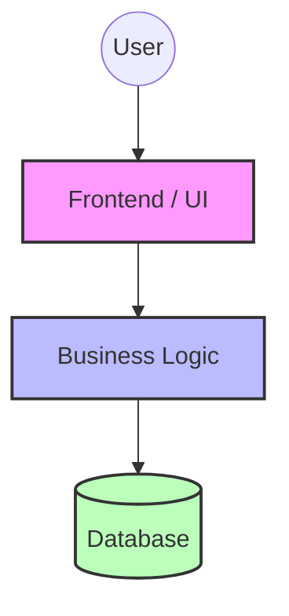
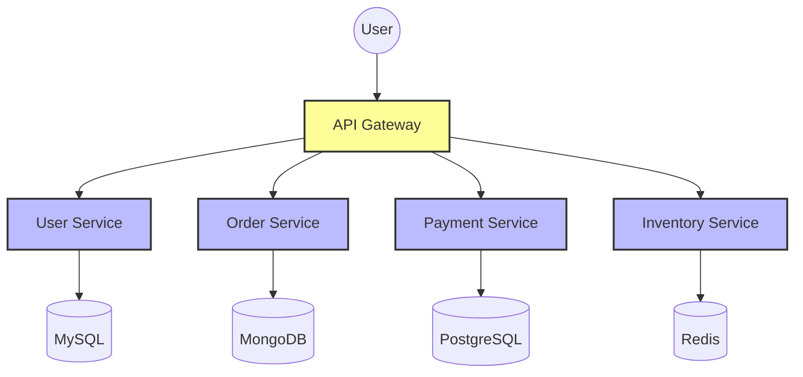

# Week 4: Monolithic & Microservices Architectures

## 1. Evolution of Application Architecture

### 1980s - Mid 1990s
* **Physical servers** inside data centers
* **Monolithic** applications
* **Waterfall** development model
* **Characteristics:** Large single applications, difficult maintenance, slow deployment.

### Late 1990s - 2000s
* **Virtualization** introduced (VMWare, KVM)
* **N-tier** applications
* **Agile** methodologies
* **Improvements:** Better resource utilization, faster development cycle, easier deployment than physical servers.

### 2010 - Present
* **Cloud computing**
* **Microservices** architecture
* **Containers** (Docker)
* **Kubernetes** orchestration
* **DevOps** culture
* **Features:** Faster deployment, better scalability, independent services, high availability.

---

## 2. Monolithic Architecture

### Definition
A monolithic application is a single large application where all components are tightly connected and deployed together.

### Structure of Monolithic Application

*All modules exist inside one application.*

### Components of Monolithic Application
1. **User Interface (UI)**
   * **Example:** Shopping website pages, Mobile app screens
   * **Technologies:** HTML, CSS, JavaScript
   * **Purpose:** Interacts with users, displays information, takes user input
2. **Data Access Layer**
   * **Example:** ProductDAO class, SQL query handling modules
   * **Technologies:** JDBC, SQLAlchemy, Entity Framework
   * **Purpose:** Communicates with database, reads/writes data
3. **Data Store**
   * **Example:** MySQL, PostgreSQL
   * **Purpose:** Stores application data, retrieves data when needed

### Advantages
* **Simple Deployment:** Only one application deployed
* **Easier Testing:** End-to-end testing simpler
* **Better Performance:** Components communicate directly in memory
* **Easy Initial Development:** Good for small applications

### Disadvantages
* **Scalability Problem:** Entire application must scale together
* **Difficult Maintenance:** Large codebase becomes hard to manage
* **Technology Barrier:** Hard to introduce new technology
* **Difficult Understanding:** New developers struggle to understand large systems

---

## 3. Microservices Architecture

### Definition
Microservices divide an application into small independent services that communicate with each other using APIs.

### Structure of Microservices Application

### Key Concepts of Microservices

1. **Smaller Independent Services**
   * *Example (Online Shopping App):* User Service, Order Service, Payment Service, Inventory Service. Each service performs one specific task.
2. **Business Goal Based Design**
   * Each microservice focuses on one business function.
   * *Example:* Payment Service → Handles payments, Inventory Service → Manages stock, User Service → Authentication.
3. **Communication Between Services**
   * Services communicate using REST APIs or Message Queues.
   * *Example:* `POST /payment/process`
4. **Separate Database Per Service**
   * *Benefit:* Loose coupling, independent scaling, better flexibility.

### Advantages of Microservices
| Advantage | Explanation |
| :--- | :--- |
| **Scalability** | Scale only required services |
| **Independent Deployment** | Deploy one service without affecting others |
| **Technology Flexibility** | Different languages/tools possible |
| **Fault Isolation** | Failure of one service doesn't crash whole system |
| **Faster Development** | Multiple teams work independently |
| **Easier Maintenance** | Small codebases easier to debug |

---

## 4. Monolithic vs Microservices

| Feature | Monolithic | Microservices |
| :--- | :--- | :--- |
| **Structure** | Single application | Multiple services |
| **Deployment** | One deployment | Independent deployment |
| **Scalability** | Entire app scaled | Individual service scaling |
| **Failure Impact** | Entire app affected | Only one service affected |
| **Maintenance** | Difficult in large systems | Easier |
| **Technology Choice** | Limited | Flexible |

---

## 5. Real-World Examples & Revision

### Real-World Examples
| Platform | Architecture |
| :--- | :--- |
| Old desktop ERP | Monolithic |
| Netflix | Microservices |
| Amazon | Microservices |
| Flipkart | Microservices |

### One-Line Revision Notes
* **Monolith** = One big application
* **Microservices** = Many small services
* **REST API** = How microservices talk to each other
* **Loose Coupling** = Services are independent

### Important Interview / Viva Questions
**Q1. Difference between Monolithic and Microservices?**
* Monolithic = Single large application
* Microservices = Small independent services

### Important Keywords
`Monolithic Architecture`, `Microservices`, `REST API`, `Loose Coupling`, `Service Discovery`, `DevOps`
