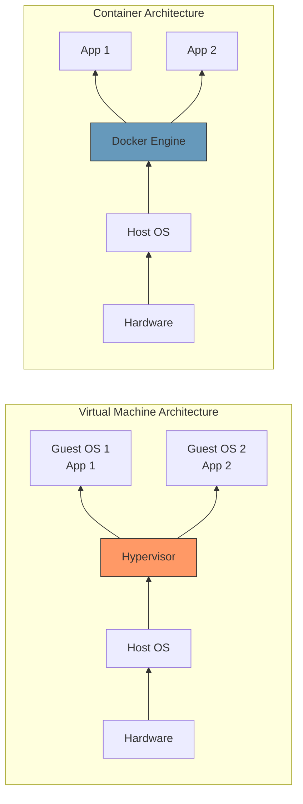

# Week 5: Containers, Docker, and Kubernetes

## 1. Containers

### Definition
Containers are lightweight virtualization technology used to run isolated applications on the same operating system.

### Features of Containers
* **Lightweight:** Faster than VMs
* **Portable:** Run anywhere
* **Isolated:** Applications separated securely
* **Efficient:** Better resource utilization

### Containers vs Virtual Machines



| Feature | Containers | Virtual Machines |
| :--- | :--- | :--- |
| **OS** | Shared Kernel | Separate OS |
| **Speed** | Fast | Slower |
| **Resource Usage** | Low | High |
| **Boot Time** | Seconds | Minutes |

### Containers and Microservices
Microservices usually run inside containers.
* **Why?** Faster deployment, better scalability, isolation, reliability.

---

## 2. Docker & Kubernetes

### Docker
**Definition:** Docker is a platform used to create and manage containers.

### Kubernetes
**Definition:** Kubernetes is a container orchestration platform.
**Functions:** Auto scaling, Self healing, Load balancing, Container management.

---

## 3. Docker Compose

### Definition
Docker Compose is a tool used to manage multi-container Docker applications using a YAML file.

### Why Docker Compose is Needed?
Without Compose, you run multiple commands:
```bash
docker run web
docker run db
docker run redis
```
**Problems:** Too many commands, networking issues, hard configuration, difficult reproducibility.

### Benefits of Docker Compose
1. **Multi-container Management:** Manage all containers together.
2. **Reproducibility:** Same setup on every machine.
3. **Simplified Networking:** Services communicate using names.
4. **Dependency Management:** Controls startup order.
5. **Scalability:** Easy scaling using commands.

---

## 4. docker-compose.yml Structure & Concepts

### Basic Structure
```yaml
version: "3.9"

services:
  web:
    image: nginx
```

### Important Concepts

**A. Services:** Blueprint for containers.
**B. Image vs Build:**
* `image: nginx` (Uses existing image)
* `build: .` (Builds custom image)

**C. Ports:** Format is `HostPort : ContainerPort`
```yaml
ports:
  - "8080:80"
```

**D. Volumes:** Used for persistent storage.
```yaml
volumes:
  - data:/var/lib/mysql
```

**E. Networks:** Compose automatically creates networks for service discovery and built-in DNS.

**F. depends_on:**
```yaml
depends_on:
  - db
```
*Important:* Ensures startup order, but does NOT ensure service readiness.

---

## 5. How Docker Compose Works & Commands

### Workflow
Docker Compose: Reads YAML file ➔ Pulls/Builds images ➔ Creates networks ➔ Creates volumes ➔ Starts containers ➔ Connects services.

### Basic Commands
* **Setup:** `docker-compose version`, `docker-compose config`
* **Starting:** `docker-compose up`, `docker-compose up -d` (detached), `docker-compose up --build`
* **Stopping:** `docker-compose down`, `docker-compose stop`, `docker-compose start`
* **Monitoring:** `docker-compose ps`, `docker-compose logs`, `docker-compose logs -f`
* **Execute Inside:** `docker-compose exec web bash`
* **Scaling:** `docker-compose up --scale web=3`

---

## 6. Docker Compose Examples

### Node.js + MongoDB Example
```yaml
version: '3.8'

services:
  app:
    image: node:18
    container_name: node-app
    working_dir: /usr/src/app
    volumes:
      - .:/usr/src/app
    command: npm start
    ports:
      - "3000:3000"
    environment:
      - MONGO_URL=mongodb://mongo:27017/mydb
    depends_on:
      - mongo

  mongo:
    image: mongo:6
    container_name: mongo-db
    ports:
      - "27017:27017"
    volumes:
      - mongo-data:/data/db

volumes:
  mongo-data:
```

### WordPress + MySQL Example
```yaml
version: '3.8'

services:
  wordpress:
    image: wordpress:latest
    container_name: wordpress-app
    ports:
      - "8080:80"
    environment:
      WORDPRESS_DB_HOST: db:3306
      WORDPRESS_DB_USER: wpuser
      WORDPRESS_DB_PASSWORD: wppass
      WORDPRESS_DB_NAME: wpdb
    depends_on:
      - db

  db:
    image: mysql:5.7
    container_name: mysql-db
    restart: always
    environment:
      MYSQL_DATABASE: wpdb
      MYSQL_USER: wpuser
      MYSQL_PASSWORD: wppass
      MYSQL_ROOT_PASSWORD: rootpass
    volumes:
      - db-data:/var/lib/mysql

volumes:
  db-data:
```

---

## 7. Real-World Examples & Revision

### Real-World Examples
| Platform | Architecture |
| :--- | :--- |
| WordPress Site | Containerized App |

### One-Line Revision Notes
* **Docker** = Container platform
* **Kubernetes** = Container manager
* **Docker Compose** = Multi-container manager
* **Volume** = Persistent storage
* **Port Mapping** = HostPort:ContainerPort
* **YAML** = Indentation-sensitive configuration format

### Important Interview / Viva Questions
**Q2. Why are containers faster than VMs?**
* Because containers share the host OS kernel.

**Q3. What is Docker Compose?**
* Tool for managing multiple containers using YAML configuration.

**Q4. What is Kubernetes?**
* Container orchestration platform for scaling and managing containers.

**Q5. What is the purpose of depends_on?**
* Controls startup order of services.

### Important Keywords
`Containers`, `Docker`, `Kubernetes`, `Docker Compose`, `YAML`, `Volumes`, `Scaling`, `Orchestration`
